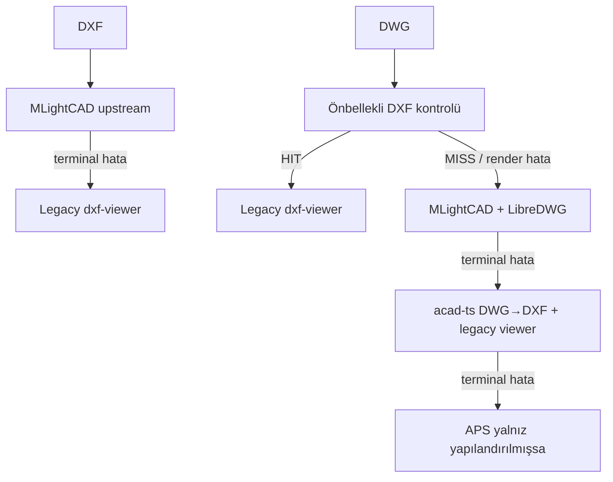
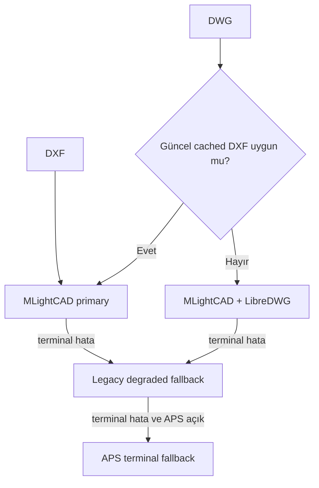

# CAD Önizleme V2 — Gemini 3.7 Flash High için nihai uygulama planı

> Tarih: 29 Ağustos 2026  
> Hedef depo: `muhendis-mimar-portali`  
> Hedef: Düzenleme yapmadan, ücretsiz ana çalışma yolunda kaliteli 2B DWG/DXF önizleme; mesafe ve alan ölçümü; katman görünürlüğü; normal entity seçiminin kapatılması; doğru metin yönü; kanıtlanmış yerel ve Vercel Preview çalışması.

## 1. Kısa karar

Bu iş için yeni bir CAD motoru, parser, renderer, OSNAP sistemi veya ölçüm matematiği yazılmayacak. Depoda 24 Ağustos 2026 tarihli `ca3f1e4` commit'iyle sekiz aşamalı MLightCAD göçü zaten tamamlanmış. Doğru yol:

1. mevcut çok motorlu hattı ölçüp sabitlemek;
2. MLightCAD adaptörünü salt-okunur önizleme araçlarıyla genişletmek;
3. hedef KZ49/KZ50 problemini entity ve motor bazında teşhis etmek;
4. önbellekli DXF yolunu da mümkünse aynı MLightCAD araç yüzeyine taşımak;
5. mevcut katman panelini yeniden kullanmak;
6. bütün özellikleri otomatik test, gerçek CAD corpus'u ve Vercel Preview ile kanıtlamak.

Gemini 3.7 Flash **High** kullanılabilir ve bu plan ona göre daraltılmıştır. Fakat planın tamamı tek komutla uygulanmamalıdır. Her seferinde yalnız bir ana adım uygulanmalı, o adım `PASS` olmadan sonraki adıma geçilmemelidir.

Toplam **10 ana adım** vardır. Her adımın sonunda kaç ana adım kaldığı bu belgede açıkça yazmaktadır.

## 2. Gerçekçi kalite sözü

“Tarayıcıda her DWG/DXF dosyasını AutoCAD, GstarCAD veya ZWCAD kadar kusursuz açar” sözü ücretsiz ve açık kaynak bir motor için evrensel olarak doğrulanamaz. Özellikle proprietary proxy object, eksik XREF, lisanslı SHX/TTF fontları, bazı ileri R2010+ DWG nesneleri ve paper-space özellikleri sınırlı olabilir.

Bu projenin verilebilir ve test edilebilir sözü şudur:

> Tanımlanmış 2B entity/font/DWG sürümü kapsamı ve onaylı gerçek proje corpus'u için, AutoCAD referansına göre ölçülmüş görsel ve sayısal doğruluk sağlanır. Destek dışı veya eksik içerik sessizce kaybolmaz; kullanıcıya anlaşılır uyarı, indirme veya fallback sunulur.

Bu ayrım kaliteyi düşürmez; “çalıştı” denilen şeyin gerçekten kanıtlanmasını sağlar.

## 3. Bugünkü depo gerçeği

### 3.1. Mevcut paketler

İnceleme anındaki tam sürümler:

| Paket | Mevcut sürüm | Rol |
| --- | ---: | --- |
| `@mlightcad/cad-simple-viewer` | `1.6.2` | Ana DXF/DWG görüntüleme ve native komutlar |
| `@mlightcad/data-model` | `1.14.2` | CAD veri modeli |
| `@mlightcad/libredwg-converter` | `3.14.2` | Tarayıcı içi ücretsiz DWG dönüşümü |
| `dxf-viewer` | `^1.0.48` | Eski/degraded DXF fallback |
| `@node-projects/acad-ts` | `2.4.0` | Eski DWG→DXF fallback |
| `framer-motion` | mevcut | Katman penceresini masaüstünde taşımak için yeniden kullanılabilir |

`cad-simple-viewer 1.6.2` içinde şu public yüzeyler zaten vardır:

- `AcEdOpenMode.Read`;
- `AcEdViewMode.PAN` — bu modda normal entity seçimi kapalıdır;
- native `measuredistance`, `measurearea`, `clearmeasurements` komutları;
- bu ölçüm komutlarının `Read` modunda çalışmasına izin veren komut tanımları;
- `AcApDocument.layerStore` ve layer change event'i;
- `setLayerOn`, `setAllLayersOn`, `isolateSingleLayer` gibi layer metotları;
- `commandManager.cancelActive()`;
- `curView.zoomToFitDrawing()`;
- `AcApSettingManager.instance.isShowCommandLine`.

Mevcut adaptör bunların çoğunu React hostuna henüz açmıyor.

### 3.2. Mevcut çalışma hattı



Ana dosyalar:

- `src/lib/dokumantasyon/cad-upstream/adapter.ts`
- `src/components/dokumantasyon/preview/cad-upstream-viewer.tsx`
- `src/components/dokumantasyon/preview/cad-runtime-orchestrator.tsx`
- `src/components/dokumantasyon/preview/cad-viewer.tsx`
- `src/components/dokumantasyon/preview/dxf-layer-panel.tsx`
- `src/lib/dokumantasyon/studio/commands.ts`
- `tests/document-studio/*`
- `scripts/check-cad-upstream-stage3.mjs` … `stage8.mjs`

Mevcut upstream host yalnız Gerçek Renk, Siyah-Beyaz ve Lineweight kontrollerini gösteriyor. Legacy DXF viewer'da ise çalışan bir katman paneli, Sığdır/Sıfırla ve indirme davranışı zaten var.

### 3.3. KZ49/KZ50 hakkında doğrulanmış önemli ayrım

Yerel özel fixture'da:

- `KZ49 25/50`: `TEXT`, handle `102C`, layer `03_KIRIS`, DXF group `50 = 90.0`;
- `KZ50 25/50`: `TEXT`, handle `102D`, layer `03_KIRIS`, DXF group `50 = 90.0`.

Bunlar dikey görünmelidir.

Fakat büyük başka bir gerçek fixture'da aynı ada benzeyen `KZ49 25/50` ve `KZ50 25/50` entity'lerinde group 50 yoktur; DXF semantiğine göre açıları `0°` ve yatay görünmeleri doğrudur.

Sonuç: **`KZ` ile başlayan metinleri 90° döndürmek kesinlikle yasaktır.** Doğrulama `dosya hash'i + entity handle + entity tipi + ham DXF değeri + parsed değer + nihai renderer transformu` üzerinden yapılacaktır.

Yerel `.data` fixture'ı ve gerçek proje ekran görüntüleri public repoya kopyalanmamalıdır. Bunlar özel acceptance girdisi olarak tutulmalıdır.

### 3.4. Kurulum sırası tuzağı

`public/cad-upstream/` git tarafından izlenmiyor; worker/WASM dosyaları `prebuild` sırasında üretiliyor. Bu nedenle temiz çalışma ağacında doğrudan:

```powershell
node scripts/check-cad-upstream-stage8.mjs
```

çalıştırmak, worker henüz üretilmediyse yanlış bir FAIL verir. Doğru doğrulama sırası:

```powershell
npm ci
npm run prebuild
node scripts/check-cad-upstream-stage8.mjs
```

Gemini bu durumu ürün hatası sanmamalı ve üretilen `public/cad-upstream/` dosyalarını elle commit etmemelidir.

## 4. Nihai ürün kapsamı

### 4.1. V1'de zorunlu kullanıcı davranışı

Hazır bir çizim açıldığında:

- varsayılan mod **Pan** olur;
- sol tarafta kompakt hızlı erişim araçları görünür;
- mouse wheel ile zoom, drag ile pan çalışır;
- tek tıklama veya seçim kutusu normal CAD entity'sini seçmez;
- kalıcı highlight, grip veya seçim bırakılmaz;
- `Delete`/`Backspace` çizimi değiştirmez;
- alttaki MLightCAD command line hiç görünmez;
- Mesafe aracı iki nokta arasını CAD world koordinatında ölçer;
- Alan aracı çokgen alanını CAD world koordinatında ölçer;
- `Esc` aktif ölçümü iptal edip Pan moduna döner;
- Enter alan ölçümünü bitirir;
- Ölçümleri Temizle yalnız oturumluk overlay'leri kaldırır;
- Katmanlar penceresi masaüstünde başlığından taşınabilir;
- mobilde güvenli bir bottom sheet olarak çalışır;
- katman aranabilir, tek tek açılıp kapatılabilir, isolate ve kaynak durumuna dönme vardır;
- dosya yeniden açıldığında layer ve ölçüm oturumu sıfırlanır;
- hiçbir önizleme aracı yeni dosya sürümü veya save isteği üretmez;
- eksik font/XREF/proxy object varsa sessiz boşluk yerine uyarı görülür.

### 4.2. Sol hızlı erişim sırası

1. Pan
2. Çizime Sığdır
3. Mesafe Ölç
4. Alan Ölç
5. Katmanlar
6. Ölçümleri Temizle

Gerçek Renk/Siyah-Beyaz/Lineweight mevcut davranışı korunur; küçük ekranda ikincil bir Görünüm popover'ına alınabilir. Kullanılmayan düzenleme araçları eklenmez.

### 4.3. V1 dışı işler

Şunlar bu 10 adıma karıştırılmayacaktır:

- CAD entity düzenleme, taşıma, silme veya kaydetme;
- yeni layer yaratma/renk/linetype değiştirme;
- markup, yorum ve revizyon;
- ölçümü sidecar olarak export/import;
- 3B ölçüm;
- yeni renderer/parser yazma;
- ODA veya başka ücretli SDK ekleme;
- APS'yi ücretsiz ana yol gibi gösterme;
- açı, yay uzunluğu, koordinat sorgusu ve layout selector. Bunlar çekirdek DoD sonrasında ayrı backlog olabilir.

## 5. Reuse ve bağımlılık kararı

### 5.1. Aynen yeniden kullanılacaklar

- MLightCAD native DXF renderer ve veri modeli;
- mevcut LibreDWG worker/WASM entegrasyonu;
- native `measuredistance`, `measurearea`, `clearmeasurements`;
- native OSNAP/input manager;
- native `layerStore` ve event sistemi;
- mevcut `DxfLayerPanel` sunumu ve layer UX dili;
- mevcut Button/Tooltip/StudioCommandButton bileşenleri;
- mevcut `framer-motion`;
- mevcut Playwright harness, CAD fixture düzeni ve runtime telemetry;
- mevcut legacy/APS fallback zinciri, yalnız gerektiği kadar.

### 5.2. Bilerek eklenmeyecekler

- `three-dxf` veya ikinci bir Three.js CAD sahnesi;
- yalnız parser olan `dxf-parser` üzerine özel renderer;
- tam Vue `@mlightcad/cad-viewer` arayüzü;
- `cad-simple-ui-plugin` V1 bağımlılığı.

`cad-simple-ui-plugin` upstream'de toolbar, ölçüm ve layer dock sağlasa da bu projede ikinci bir UI state/theme sistemi yaratır, mevcut React panelini tekrarlar ve gereksiz düzenleme yüzeyi taşır. Native core komutları alınacak; UI mevcut React tasarım sisteminde kalacaktır.

### 5.3. `cad-simple-viewer 1.6.3` politikası

Mevcut `1.6.2`, gerçek corpus ve Vercel'den geçmiş sürümdür. Önce `Read + PAN + selectionSet.clear()` ile seçim sözleşmesi test edilecektir.

`1.6.3` tag'inde public `entitySelectionEnabled=false` API'si vardır ve normal hover/click/box seçimini kapatıp ölçüm/review overlay'lerini korumak üzere yazılmıştır. Ancak yalnız bu özellik için kör yükseltme yapılmayacaktır.

Karar kuralı:

- `1.6.2` seçim, ölçüm ve OSNAP testlerinin tamamını geçerse sürüm korunur.
- Seçim sızıntısı tekrarlanabiliyorsa veya text fix'i resmi `1.6.3` içinde doğrulanırsa, ayrı dependency checkpoint'inde `1.6.3` denenir.
- Yükseltme yapılırsa `package-lock`, transitive `@mlightcad/three-renderer`, stage8 exact-pin kontrolü ve gerçek corpus birlikte doğrulanır.
- Corpus gate'i geçmezse aynı checkpoint geri alınır; iki sürüm karışık bırakılmaz.

## 6. Ücretsiz çalışma ve lisans tanımı

Bu planda “ücretsiz” şu üç koşulun birlikte sağlanmasıdır:

1. CAD'i açmak için kullanıcıdan AutoCAD/GstarCAD/ZWCAD lisansı istenmez.
2. Ana acceptance akışı ücretli APS/ODA/API çağrısı olmadan geçer.
3. Kullanılan açık kaynak lisanslarının dağıtım yükümlülükleri karşılanır.

Önemli gerçekler:

- MLightCAD core/native DXF yolu MIT'tir.
- `@mlightcad/libredwg-converter 3.14.2` GPL-3.0'dır.
- Worker/WASM'i tarayıcıya dağıtmak için GPL metni, telif bildirimleri, exact source/commit ve karşılık gelen kaynak erişimi korunmalıdır.
- `THIRD_PARTY_NOTICES.md`, `public/cad-upstream/GPL-NOTICE.txt` ve asset hash kontrolleri release gate'idir.
- Bu belge hukuk tavsiyesi değildir. Proje kapalı kaynağa dönerse GPL kararı yeniden incelenmelidir.
- APS mevcut terminal fallback olarak kalabilir; fakat APS env'leri kapalı acceptance koşusunda hiçbir APS çağrısı yapılmamalıdır.
- Upstream `cad-data` fontlarını topluca kopyalamak yasaktır. Yalnız açık lisanslı veya proje sahibinin dağıtım hakkına sahip olduğu fontlar kullanılmalıdır.

## 7. Her adım için zorunlu çalışma kuralları

Gemini her ana adımda aşağıdaki sırayı izlemelidir:

1. `git status --short` çalıştır ve kullanıcının mevcut değişikliklerini kaydet.
2. Yalnız o adımda belirtilen dosyaları oku.
3. Kullanacağı upstream API'yi kurulu `.d.ts`/source içinde `rg` ile doğrula.
4. Önce mevcut davranışı ölç veya failing regression testi üret.
5. En küçük genel düzeltmeyi uygula.
6. Hedefli testleri, TypeScript ve ilgili mevcut gate'leri çalıştır.
7. Kanıtı üretmeden `PASS` deme.
8. Bir gate FAIL ise sonraki adıma geçme.
9. Kullanıcıdan izin almadan push, production deploy, GitHub issue/PR yayını veya ücretli servis işlemi yapma.
10. Kapsam dışı refactor, toplu formatlama ve dependency güncellemesi yapma.

Her adımdan sonra zorunlu rapor:

```text
Adım X/10: PASS | FAIL | BLOCKED
Tamamlanan sonuç:
Değişen dosyalar:
Çalıştırılan kontroller:
Sonuç ve somut kanıt:
Aktif engine/path:
Yeni varsayım veya teknik borç:
Kalan yaklaşık ana adım: 10-X
Sıradaki tek adım:
```

`FAIL` ile `BLOCKED` aynı şey değildir. Test hatası `FAIL`dir ve teşhis sürer. Gerçekten dış girdi/izin gerekmiyorsa `BLOCKED` denmez.

---

# 8. Uygulama adımları

## ADIM 1/10 — Değiştirilemez baseline ve hedef dosya eşlemesi

### Amaç

Kod yazmadan önce bugünkü repo, yerel production build, gerçek URL, gerçek source bytes, aktif motor ve mevcut hataları tek bir baseline raporunda sabitlemek.

### Okunacak dosyalar

- `PROJECT.md`
- `.agents/rules/dokumantasyon-kurallari.md`
- `.agents/rules/vercel-kurallari.md`
- `DOK_CONTEXT_MAP.md`
- `dokumantasyon.md`
- `docs/cad-upstream-migration-stage8.md`
- yukarıda listelenen üç CAD runtime dosyası
- mevcut CAD testleri ve stage script'leri

Eski öneri belgelerinde adı geçen `AGENTS.md` ve `docs/DOKUMANTASYON_CAD_MIMARI_HAFIZA.md` bu repoda yoktur. Gemini bunları arayıp işi durdurmamalı veya boş dosya oluşturmamalıdır.

### Yapılacaklar

1. HEAD, branch, Node/npm sürümü ve `git status` kaydedilir.
2. Kullanıcının verdiği canlı dosya URL'sinin file ID'si yalnız özel acceptance notunda tutulur; token veya erişim URL'si commit edilmez.
3. API/yerel DB üzerinden file ID → source/version/storage eşlemesi yapılır.
4. Source byte SHA-256, boyut, uzantı, sürüm ID ve varsa cached-DXF derivative ID/hash kaydedilir.
5. Hedef KZ entity'leri için exact handle, owner block, layer, entity type ve group 50/210/11 değerleri çıkarılır.
6. Tarayıcıda `data-cad-engine`, `data-transition-reason`, cache HIT/MISS, ready time, entity count ve warning'ler kaydedilir.
7. Normal tıklama seçimi, command line, KZ yönü, pan/zoom, mevcut layer davranışı ayrı ayrı PASS/FAIL olarak kaydedilir.
8. Küçük, orta ve büyük mevcut gerçek fixture için açılış süresi ve peak memory baseline'ı alınır.
9. Kurulum/gate sırası doğru biçimde çalıştırılır.

### Doğrulama komutları

```powershell
git status --short
git rev-parse HEAD
npm ci
npm run prebuild
node scripts/check-cad-upstream-stage3.mjs
node scripts/check-cad-upstream-stage4.mjs
node scripts/check-cad-upstream-stage5.mjs
node scripts/check-cad-upstream-stage6.mjs
node scripts/check-cad-upstream-stage7.mjs
node scripts/check-cad-upstream-stage8.mjs
```

Mevcut browser testleri de ilgili fixture/env hazırsa çalıştırılır:

```powershell
npx playwright test --config=playwright.config.ts tests/document-studio/cad-dxf.spec.ts --project=chromium
npx playwright test --config=playwright.config.ts tests/document-studio/cad-real-repository.spec.ts --project=chromium
```

### Üretilecek kanıt

`docs/cad-preview-v2/01-baseline.md`:

- yalnız genel ve paylaşılabilir bulgular;
- özel CAD path/token/screenshot içermez;
- özel dosya kanıtı CI private artifact veya yerel ignored klasörde tutulur.

### PASS ölçütü

- Hedef dosyanın hangi byte ve engine yolunda açıldığı tartışmasız bellidir.
- KZ problemi varsa exact entity ile tekrarlanmıştır; yoksa “mevcut sürümde zaten doğru” diye kanıtlanmıştır.
- Bugünkü selection/command line/layer/measure davranışı kaydedilmiştir.
- Baseline test sonucu ve bilinen mevcut hatalar raporlanmıştır.

### FAIL olursa

Source/URL eşlemesi yapılamıyorsa görsel düzeltmeye başlanmaz. Kullanıcıdan erişim veya exact dosya istenir. Worker yoksa önce `npm run prebuild` uygulanır; package/gate kodu değiştirilmez.

**Bu adım PASS olduğunda kalan yaklaşık ana adım: 9.**

---

## ADIM 2/10 — Deterministik test corpus'u ve AutoCAD oracle'ı

### Amaç

Gemini'nin ekrandaki rastgele piksellere tıklayarak veya metin adına bakarak “düzeldi” demesini engellemek.

### Yapılacaklar

1. Önce mevcut fixture'lar envanterlenir; aynı şeyi yapan yeni fixture üretilmez.
2. Eksikse küçük, telifsiz ve sanitize mikro fixture'lar eklenir:
   - TEXT `0/90/180/270°`;
   - TEXT alignment `10/11 + 72/73`, generation flag ve extrusion;
   - MTEXT yalnız group 50, yalnız direction vector ve ikisi birlikte;
   - ATTRIB + INSERT rotation;
   - nested INSERT, negatif ve non-uniform scale;
   - Türkçe/Unicode ve eksik font;
   - bilinen ölçülü mm, metre, inch ve unitless geometriler;
   - açık/kapalı layer, frozen/locked, layer 0 ve nested block;
   - line/polyline/bulge/arc/spline, hatch, dimension, color, transparency ve lineweight;
   - eksik XREF ve proxy/unsupported entity uyarısı.
3. Hedef özel dosya public fixture'a kopyalanmaz. `CAD_REAL_FIXTURE_ROOT` benzeri mevcut özel-corpus düzeni kullanılır.
4. Her fixture için manifest oluşturulur: SHA-256, beklenen engine, entity sayısı, handle, açı, ölçüm değeri, birim ve destek beklentisi.
5. Hedef KZ özel fixture'ında `102C` ve `102D` için `90°` oracle'ı; kontrol fixture'ında aynı isimli ama rotation `0°` entity eklenir.
6. AutoCAD/GstarCAD/ZWCAD'den aynı viewport, layout, font ve layer durumuyla bir kez onaylı referans görüntü alınır.
7. Gizli gerçek proje golden'ı public GitHub'a commit edilmez. Sanitize mikro golden'lar commit edilebilir.
8. Playwright cache HIT/MISS'i network route mocking ile zorlar; production'a “engine seç” query backdoor'u eklenmez.
9. Canvas tıklamaları sabit piksel yerine public `worldToScreen` test helper'ıyla üretilir.

### Yeni/uyarlanacak testler

- `tests/document-studio/cad-preview-v2-contract.spec.ts`
- `tests/document-studio/cad-text-orientation-v2.spec.ts`
- `tests/fixtures/cad-preview-v2/*`
- gerekirse yalnız testte kullanılan typed fixture manifest/helper

### PASS ölçütü

- Her önemli davranış için deterministik oracle vardır.
- Yanlış davranışlar başlangıçta açıkça failing regression testi olarak görülebilir.
- 90° KZ ile 0° KZ birbirinden ayrılır.
- Gerçek özel CAD verisi public repoya sızmaz.
- Cache ve engine yolu tesadüfe bağlı değildir.

### FAIL olursa

AutoCAD referansı yoksa parsed rotation ve sayısal geometri testleri yazılabilir; fakat tam görsel fidelity “PASS” ilan edilmez. Referans bekleyen madde açık tutulur.

**Bu adım PASS olduğunda kalan yaklaşık ana adım: 8.**

---

## ADIM 3/10 — Salt-okunur önizleme sözleşmesi, seçim ve command line

### Amaç

Önce güvenli viewer davranışını sabitlemek; ölçüm ve layer UI'sını bunun üzerine kurmak.

### Birincil uygulanacak çözüm — mevcut 1.6.2

`CadUpstreamAdapter` içinde:

1. `AcEdOpenMode.Read` açıkça import edilir.
2. `openOptions` içinde `mode: AcEdOpenMode.Read` en son yazılır; çağıran kod bunu `Write` ile override edemez.
3. Gerekirse `databaseOptions` tipi `mode` alanını kabul etmeyecek biçimde daraltılır.
4. Manager yaratılmadan önce `AcApSettingManager.instance.isShowCommandLine = false` uygulanır.
5. Dosya açıldıktan sonra `curView.mode = AcEdViewMode.PAN` yapılır.
6. `curView.selectionSet.clear()` uygulanır.
7. File switch/retry sonrası da aynı invariant doğrulanır.
8. `Delete` ve `Backspace` için hemen DOM guard yazılmaz. `Read + PAN` testi geçmiyorsa en dar host-scoped guard eklenir.

Command line ayarı bu üründe kalıcı bir **site politikasıdır**; naive mount snapshot/unmount restore yapılmayacaktır. Çünkü aynı origin'deki tek MLightCAD hostu bu preview'dur, kullanıcı command line'ı hiçbir oturumda istememektedir ve restore yaklaşımı iki tab arasında yarışıp command line'ın geri görünmesine neden olabilir. İleride aynı origin'de tam editör eklenirse setting ownership ayrıca tasarlanmalıdır.

### 1.6.3 canary dalı

Önce yukarıdaki çözüm test edilir. Normal tıklama/hover/box seçimi veya ölçümden sonra selection sızıntısı kalırsa:

1. `@mlightcad/cad-simple-viewer` exact `1.6.3` canary checkpoint'i açılır.
2. Lockfile'ın `@mlightcad/three-renderer 1.6.3` ile uyumu doğrulanır.
3. `curView.entitySelectionEnabled = false` yalnız `.d.ts`/tag source içinde doğrulandıktan sonra kullanılır.
4. Native ölçüm point-picking ve OSNAP'ın bu ayarla bozulmadığı test edilir.
5. Bütün stage3–8 ve real corpus testleri çalışır.
6. Hepsi geçerse pin/gate/notices güncellenir; geçmezse canary tamamen geri alınır ve 1.6.2 korunur.

### Adaptöre eklenecek güvenli yüzey

- `fitDrawing(): void`
- `cancelActiveTool(): Promise<void>` — `manager.commandManager.cancelActive()` kullanır
- `getPreviewState()` — open mode, view mode ve selection count gibi testlenebilir güvenli durum

Manager veya private renderer nesnesi doğrudan React bileşenine verilmez.

### Zorunlu testler

- normal click entity seçmez;
- hover highlight yoktur;
- drag seçim kutusu oluşturmaz, Pan yapar;
- `Delete`/`Backspace` entity count/hash değiştirmez;
- wheel zoom ve pointer pan çalışır;
- measurement aktifken point picking çalışır;
- measurement bittiğinde/cancel olduğunda Pan geri gelir;
- OSNAP seçimsiz modda çalışır;
- command line DOM'u reload, retry, file switch ve iki tabda görünmez;
- source bytes ve version count değişmez.

### PASS ölçütü

Read mode assertion, seçim testi, Pan/zoom, command line ve OSNAP testleri birlikte geçer. Birini bozup diğerini düzeltmek PASS değildir.

**Bu adım PASS olduğunda kalan yaklaşık ana adım: 7.**

---

## ADIM 4/10 — KZ49/KZ50 ve genel metin yönü root-cause düzeltmesi

### Amaç

Hedef yazıları doğru göstermek ve aynı düzeltmenin TEXT/MTEXT/ATTRIB/nested INSERT için genel CAD semantiğine uygun olduğunu kanıtlamak.

### Zorunlu teşhis sırası

Uygulama koduna dokunmadan önce aşağıdaki zincir raporlanır:

1. exact source SHA ve active engine;
2. source DXF mi, cached derivative mı, LibreDWG çıktısı mı;
3. entity type ve exact handle;
4. ham group 50, direction vector, alignment, style flag, extrusion;
5. parent INSERT/block transformları;
6. parsed data-model rotation — DXF derece değeri doğru yerde radyana çevrilmiş mi;
7. renderer'a verilen local transform;
8. world transform ve ekrandaki orientation;
9. kullanılan gerçek font ve font substitution.

Özel hedef için beklenen:

- handle `102C`: raw `90.0°`, parsed yaklaşık `Math.PI / 2`;
- handle `102D`: raw `90.0°`, parsed yaklaşık `Math.PI / 2`.

Kontrol entity'sinde group 50 yoksa beklenen `0°`dir.

### Root-cause karar ağacı

| Kırılan katman | Yapılacak düzeltme |
| --- | --- |
| Yanlış/stale cached derivative | version/hash cache key ve invalidation düzeltilir |
| Yanlış engine/fallback | orchestrator routing düzeltilir |
| Raw doğru, parsed yanlış | genel parser/entity mapping düzeltmesi |
| Parsed doğru, renderer yanlış | genel renderer transform düzeltmesi |
| Yalnız nested block yanlış | parent/child matrix composition düzeltmesi |
| Yalnız font metriği yanlış | lisanslı font mapping veya görünür substitution uyarısı |
| Mevcut upstream zaten doğru | kod yazılmaz; yalnız regression testi ve deployment parity düzeltilir |

Dependency bug'ıysa öncelik sırası:

1. problemi çözen resmi exact MLightCAD release'i varsa canary + corpus;
2. yoksa upstream issue/PR için minimal genel patch hazırlanır;
3. kullanıcı yayına izin vermeden issue/PR gönderilmez;
4. release beklenemiyorsa exact sürüme bağlı, küçük ve izlenebilir dependency patch'i kullanılabilir;
5. patch'te KZ adı, dosya adı veya koordinat bulunmaz.

### Kesin yasaklar

- `text.startsWith("KZ")`;
- CSS `rotate(90deg)`;
- DOM overlay ile gerçek CAD text'i kapatma;
- yalnız screenshot oranından açı çıkarmak;
- derece/radyan dönüşümünü iki kez yapmak;
- entity tipi doğrulanmadan MTEXT'e özel patch yazmak.

### Test matrisi

- TEXT 0/90/180/270;
- STYLE vertical/mirror/upside-down;
- TEXT OCS/extrusion/alignment;
- MTEXT group50 ve direction last-wins sırası;
- ATTRIB local rotation;
- INSERT/ATTRIB parent rotation;
- nested, negative ve non-uniform scale;
- Türkçe Unicode;
- hedef `102C/102D`;
- aynı isimli 0° kontrol entity'si;
- AutoCAD onaylı aynı viewport görseli.

### PASS ölçütü

- raw→parsed açı farkı en fazla `0.01°`;
- beklenen dünya yönü farkı en fazla `0.5°`;
- 90° hedefler dikey, 0° kontrol yataydır;
- mevcut doğru text fixture'larında görsel regression yoktur;
- çözüm KZ adına özel değildir;
- gerçek font yoksa yanlış “tam eşleşme” yerine açık uyarı vardır.

**Bu adım PASS olduğunda kalan yaklaşık ana adım: 6.**

---

## ADIM 5/10 — Primary runtime'ı tek araç yüzeyinde birleştirme

### Amaç

Ölçüm/layer araçlarını yalnız bazı dosyalarda çalışan bir dekor olmaktan çıkarmak.

Bugün cache HIT DWG'nin DXF türevi legacy viewer'a gidiyor. Bu yol olduğu gibi bırakılırsa aynı `.dwg` bazen ölçüm araçlarına sahip, bazen sahip olmayan viewer'da açılır. V1 için primary yollar birleştirilmelidir.

### A/B spike

Aynı cached DXF byte'ı iki hostta açılır:

- A: mevcut `CurrentCadViewer`;
- B: `DokCadUpstreamViewer`.

Karşılaştırma:

- entity/text/dimension/layer count;
- hedef text orientation;
- golden screenshot;
- ready time p50/p95;
- peak memory;
- warning/unsupported list;
- layer ve native measurement çalışması.

### Karar kuralı

1. Cached DXF + upstream fidelity gate'ini geçiyor ve ready time p95 mevcut yola göre `%20`den, peak memory `%20`den fazla kötüleşmiyorsa cache HIT yolu upstream hosta taşınır.
2. Cached derivative stale veya fidelity açısından bozuksa, direct DWG + upstream yolu tercih edilir; cache “hızlı” diye yanlış görüntü göstermez.
3. Upstream terminal hata verirse legacy fallback korunur.
4. Legacy fallback için bu sürümde yeni özel measurement engine yazılmaz. Araç desteklenmiyorsa disabled + “Bu yedek görüntüleme modunda kullanılamıyor; orijinali indir” açıklaması görünür.
5. APS yalnız yapılandırılmış terminal fallback olarak kalır ve ücretsiz acceptance'ta çağrılmaz.

### Hedef runtime modeli



`data-cad-engine` motoru, ayrı `data-cad-source` ise `original-dxf`, `cached-dxf`, `original-dwg` gibi byte kaynağını söylemelidir. “fast” hem kaynak hem motor adı olarak kullanılmamalıdır.

### Capability contract

Typed bir capability modeli kullanılır:

- `pan`
- `fit`
- `measureDistance`
- `measureArea`
- `clearMeasurements`
- `layers`
- `download`

Primary upstream yollarında hepsi zorunludur. Legacy/APS terminal fallback'ında desteklenmeyenler açıkça false olur. UI motor adını bilerek if/else yazmaz; capability okur.

### PASS ölçütü

- Aynı desteklenen dosya cache HIT/MISS'e göre farklı araç deneyimi yaşamaz.
- Primary DXF, cached-DXF DWG ve direct-DWG corpus'u aynı toolbar/layer/measure sözleşmesini geçer.
- Legacy yalnız gerçek terminal fallback'tır.
- Routing kararı `docs/cad-preview-v2/05-runtime-decision.md` içinde sayısal kanıtla kaydedilir.

**Bu adım PASS olduğunda kalan yaklaşık ana adım: 5.**

---

## ADIM 6/10 — Sol toolbar + native mesafe/alan dikey dilimi

### Amaç

Butonu, komutu, sonuç overlay'ini, iptali ve testi aynı adımda tamamlamak. Çalışmayan buton önce UI'ya eklenmez.

### Adaptör sözleşmesi

Private manager'ı dışarı vermeden typed metotlar eklenir:

- `startDistanceMeasurement(): Promise<void>`
- `startAreaMeasurement(): Promise<void>`
- `clearMeasurements(): Promise<void>`
- `cancelActiveTool(): Promise<void>`
- `fitDrawing(): void`
- `subscribeToolState(listener): unsubscribe`
- `getCapabilities()`

Uygulama:

- `await manager.executeCommandString("measuredistance")`;
- `await manager.executeCommandString("measurearea")`;
- `await manager.executeCommandString("clearmeasurements")`;
- iptal için `await manager.commandManager.cancelActive()`;
- ardından Pan invariant'ı ve boş normal selection tekrar uygulanır.

Mesafe/alan matematiği, polygon kapanması, live preview, OSNAP ve unit formatting yeniden yazılmaz.

### UI davranışı

- Toolbar viewport'un solunda, canvas'ın üstünde ve içerikten bağımsızdır.
- Hazır olmadan butonlar disabled'dır.
- Aktif buton `aria-pressed=true` ve görünür focus taşır.
- Her ikonun Türkçe tooltip/ARIA etiketi vardır.
- Araç aktifken küçük durum chip'i görünür:
  - Mesafe: “İki nokta seçin • Esc iptal”
  - Alan: “Noktaları seçin • Enter bitir • Esc iptal”
- Command line gizli kalır.
- Yeni measure seçmek eski aktif komutu önce güvenle iptal eder.
- File switch/unmount aktif komutu ve overlay listener'larını temizler.
- Unitless çizimde “m” veya “mm” uydurulmaz; “çizim birimi / çizim birimi²” olarak açık davranış tanımlanır.

### Sayısal acceptance

Sanitize fixture örneği:

- noktalar `(0,0)` ve `(3000,4000)` → mesafe `5000` çizim birimi;
- `3000 × 4000` dikdörtgen → alan `12,000,000` çizim birimi².

Tolerans:

- sentetik world-coordinate sonuçlarında `max(1e-6 çizim birimi, beklenen × 1e-9)`;
- UI rounding ayrı test edilir, geometri sonucu rounded badge'den türetilmez.

### Zorunlu interaction testleri

- distance iki nokta + sonuç;
- area üç/dört nokta + Enter;
- area ilk noktaya yakın tıklayarak kapanma;
- self-intersection davranışı;
- Esc ilk/ikinci/üçüncü noktada;
- tool değişimi;
- clear;
- farklı zoom ve DPR 1/1.25/2;
- endpoint/midpoint/center/intersection/nearest OSNAP;
- hidden layer entity'sine snap edilmemesi;
- selection count her normal durumda sıfır;
- reload/file switch sonrası eski overlay yok.

### PASS ölçütü

Distance, area, clear ve cancel gerçek Chromium'da çalışır; sayısal oracle geçer; source/version değişmez; command line görünmez; Pan geri gelir.

**Bu adım PASS olduğunda kalan yaklaşık ana adım: 4.**

---

## ADIM 7/10 — Genel, taşınabilir ve oturumluk Katmanlar paneli

### Amaç

Mevcut çalışan paneli atmayıp hem legacy hem upstream adapter ile kullanılabilen sunum bileşenine dönüştürmek.

### Refactor sınırı

`DxfLayerPanel` sunumu generic hale getirilir; motor davranışı adapterlarda kalır. Örnek ortak model:

```ts
type CadLayerItem = {
  name: string;
  displayName: string;
  color?: string;
  visible: boolean;
  sourceVisible: boolean;
  frozen?: boolean;
  locked?: boolean;
  objectCount?: number;
};
```

UI upstream manager veya `AcApLayerStore` import etmez.

### Upstream layer adapter

1. Dosya açıldığında `curDocument.layerStore.getLayers()` okunur.
2. `layerStore.events.changed` subscribe edilir.
3. İlk kaynak `isOn/isFrozen` snapshot'ı tutulur.
4. Tek katman visibility için public `setLayerOn` kullanılır.
5. Isolate için public `isolateSingleLayer` kullanılır.
6. Hepsini göster için `setAllLayersOn` kullanılır.
7. Kaynağa dön ilk snapshot'taki on/off durumlarını uygular.
8. Unmount/document switch sırasında listener kaldırılır.

Buradaki `layerStore` çağrıları in-memory CAD database layer state'ini değiştirebilir. Bu kabul edilebilir, çünkü “preview-only” sözleşmesi **kaynak byte/sürüm kaydetmemek** demektir; sıfır RAM mutasyonu demek değildir. Buna karşılık:

- open mode daima Read kalır;
- save/export/version API'si yoktur;
- source blob hash değişmez;
- reload'da kaynak layer state'i geri gelir.

### UX

- desktop: yaklaşık 340 px panel, yalnız header drag handle ile taşınır;
- `framer-motion` ve mevcut dependency kullanılır;
- panel viewer sınırları dışına çıkamaz;
- resize/theme/file switch'te güvenli konuma clamp edilir;
- arama inputu veya layer satırına tıklamak drag başlatmaz;
- panel pointer/wheel event'i canvas'a sızmaz;
- mobile: draggable floating pencere yerine güvenli bottom sheet;
- layer search Türkçe locale ile çalışır;
- görünür/toplam sayı;
- tek tık aç/kapat;
- “Yalnız bunu göster”;
- “Hepsini göster”;
- “Kaynağa dön”;
- frozen/locked/source-off badge'leri;
- object count upstream'de güvenilir değilse gösterilmez, sahte `0` yazılmaz.

MLightCAD public API bütün katmanları aynı anda kapatmayı güvenli biçimde garanti etmiyorsa mevcut “Tümünü kapat” etiketi upstream için kullanılmaz. Yanlış söz yerine isolate/hepsini göster/kaynağa dön yeterlidir.

### Testler

- source-off layer ilk açılışta kapalı;
- tek layer aç/kapat canvas ve snapshot'ı değiştirir;
- isolate ve source reset;
- nested block/layer 0;
- frozen/locked görünümü;
- 100 ve 500 layer arama/scroll;
- panel drag constraint;
- mobile bottom sheet;
- panel açıkken canvas yanlış pan/zoom yapmaz;
- file switch/reload/session reset;
- network save/version çağrısı yok;
- source SHA aynı.

### Performans hedefi

- 100 layer panel açılışı `<150 ms`;
- 500 layer panel açılışı `<300 ms`;
- arama inputunda hissedilir main-thread bloklaması yok;
- her toggle tam çizimi gereksiz reparse etmez.

### PASS ölçütü

Primary motorlarda layer aç/kapat/isolate/reset çalışır; panel taşınır; kaynak dosya ve sürümler değişmez; mobile/a11y testleri geçer.

**Bu adım PASS olduğunda kalan yaklaşık ana adım: 3.**

---

## ADIM 8/10 — Dayanıklılık, güvenlik, performans ve fallback parity

### Amaç

Tek happy-path demosunu production kalitesine dönüştürmek.

### No-persist ve ağ güvenliği

Öncesi/sonrası karşılaştırılır:

- source blob SHA-256;
- ETag/source version ID;
- file version count;
- derivative source-version bağı;
- network method + endpoint allowlist.

Yalnız `PUT/PATCH/DELETE` engellemek yeterli değildir; POST tabanlı save/version endpoint'leri de yakalanır. Ölçüm/layer işlemleri yalnız kaynak GET, worker/font asset GET ve mevcut read-only status GET'lerini üretmelidir.

### Lifecycle/concurrency

- hızlı art arda file switch;
- route change;
- retry;
- reload;
- aynı tabda mount/unmount;
- iki eşzamanlı tab;
- AbortController cleanup;
- event listener cleanup;
- worker terminate;
- Object URL revoke;
- active measurement cancel;
- command line'ın hiçbir anda geri gelmemesi.

### Hata enjeksiyonu

- truncated/malformed DXF;
- malformed/unsupported DWG;
- worker 404;
- WASM 404/yanlış MIME;
- worker timeout/crash;
- WebGL context loss;
- font 404;
- missing XREF;
- stale cached derivative;
- private source 401/403;
- büyük dosyada abort/file switch.

Boş canvas “success” sayılamaz. Entity count sıfır ve renderer idle ise mevcut blank-document davranışı korunur.

### Performans no-regression gate'i

Adım 1 baseline'ına göre aynı cihaz/tarayıcıda:

- ready-time p50 en fazla `%15` kötüleşir;
- ready-time p95 en fazla `%20` kötüleşir;
- peak heap en fazla `%20` kötüleşir;
- mevcut 35/120/180 saniyelik boyuta bağlı terminal deadline'lar korunur;
- toolbar/panel etkileşimi açılış parsing'ini gereksiz yeniden başlatmaz;
- 53 MB gerçek DXF ve mevcut üç gerçek DWG corpus'u terminal sonuca ulaşır.

Eşik aşılırsa “dosya yine açılıyor” gerekçesiyle PASS verilmez; profile alınır ve regresyon giderilir veya bilinçli karar kaydı çıkarılır.

### Tarayıcı ve cihaz

- Playwright Chromium zorunlu;
- gerçek güncel Chrome ve Edge zorunlu manuel smoke;
- touch/pinch için mobil Chrome emülasyonu + mümkünse gerçek cihaz;
- desteklenecekse Firefox ayrı gate; geçmeden “tüm modern tarayıcılar” denmez.

### Erişilebilirlik

- keyboard focus order;
- görünür focus;
- tooltip ve ARIA label;
- active tool `aria-pressed`;
- panel Escape davranışı;
- reduced-motion;
- light/dark contrast;
- 200% zoom;
- touch target en az 44×44 px mobilde.

### Fallback kabulü

- primary DXF/DWG: bütün V1 capability'leri zorunlu;
- terminal legacy/APS: capability false ise disabled + açıklama;
- engine/fallback sebebi diagnostics'te bulunur ama son kullanıcıya anlaşılır Türkçe gösterilir;
- fallback sessizce daha düşük fidelity'yi “başarı” diye sunmaz.

### PASS ölçütü

Bütün no-persist, lifecycle, hata enjeksiyonu, performans, mobile ve a11y gate'leri geçer; destek dışı terminal fallback açıkça işaretlenir.

**Bu adım PASS olduğunda kalan yaklaşık ana adım: 2.**

---

## ADIM 9/10 — Ücretsiz/lisans gate'i ve temiz production build

### Amaç

Çalışan kodun başka bilgisayarda, temiz kurulumda ve ücretli CAD servisi olmadan üretilebilir olduğunu kanıtlamak.

### Lisans/SBOM kontrolü

1. Exact dependency tree ve lockfile kaydedilir.
2. `cad-simple-viewer`, `data-model`, `libredwg-converter`, `libredwg-web`, `acad-ts`, `dxf-viewer` lisansları doğrulanır.
3. Shipped worker/WASM hash'i, exact upstream commit/source archive ve build talimatı kaydedilir.
4. GPL notice/source reference gate'i geçer.
5. Font dosyalarının lisans ve dağıtım hakkı tek tek doğrulanır.
6. Lisans kanıtı olmayan Arial/SHX/cad-data dosyası eklenmez.
7. Güvenlik override'ları (`tar`, `lodash-es`) korunur.

### Sıfır ücretli servis acceptance

APS/ODA ve diğer ücretli CAD env'leri temiz bir acceptance çalıştırmasında yoktur. Network logunda bu servislere çağrı olmadan:

- primary DXF corpus'u açılır;
- primary DWG corpus'u LibreDWG ile açılır;
- distance/area/layers çalışır;
- fallback gerekiyorsa dürüst uyarı verir.

“Ücretsiz” Vercel Hobby kotasının veya kullanıcı RAM/CPU'sunun sınırsız olduğu anlamına gelmez. CAD parse/render tarayıcı worker'ında kalır; büyük CAD byte'ları 4.5 MB buffered Vercel Function body'ye taşınmaz. Private storage varsa stream/presigned erişim, abort, ETag ve auth korunur.

### Temiz build sırası

Disposable clean checkout/CI runner üzerinde:

```powershell
npm ci
npm run prebuild
node scripts/check-cad-upstream-stage3.mjs
node scripts/check-cad-upstream-stage4.mjs
node scripts/check-cad-upstream-stage5.mjs
node scripts/check-cad-upstream-stage6.mjs
node scripts/check-cad-upstream-stage7.mjs
node scripts/check-cad-upstream-stage8.mjs
npx tsc --noEmit --incremental false
npm run lint
npm run build
```

Ardından hedefli Playwright suite ve real corpus çalışır. Full-repo lint'te önceden var olan ilgisiz hata çıkarsa yeni hata ile baseline hata ayrıştırılır; yeni değişiklik lint hatasıyla bırakılamaz.

Vercel static asset kontrolleri:

- worker `Content-Type`;
- WASM `application/wasm`;
- CSP `worker-src`, `connect-src`, font kaynakları;
- same-origin asset path;
- immutable hash/cache politikası;
- public CAD URL sızıntısı olmaması;
- worker/WASM asset boyutu ve platform limiti.

### PASS ölçütü

Fresh install + prebuild + typecheck + lint + production build + CAD suite geçer; APS kapalı gerçek corpus açılır; notice/source/font lisans kanıtı tamdır.

**Bu adım PASS olduğunda kalan yaklaşık ana adım: 1.**

---

## ADIM 10/10 — Vercel Preview, gerçek kullanıcı kabulü ve release paketi

### Amaç

Yerelde çalışan özelliğin gerçek deployment'ta da aynı olduğunu kanıtlamak; production'a kontrollü geçiş hazırlamak.

### Vercel Preview

Kullanıcı deploy yetkisi verdiyse yalnız Preview deployment oluşturulur. Production promote ayrıca açık onay gerektirir.

Preview'da:

- worker/WASM/font response'ları;
- CSP/CORS/MIME;
- private CAD auth;
- hedef user URL;
- cache HIT ve MISS;
- direct DXF ve DWG;
- gerçek Chrome/Edge;
- desktop ve mobile;
- cold/warm load;
- fallback telemetry;
- no paid API network logu doğrulanır.

### Kullanıcı kabul senaryosu

Kullanıcının verdiği exact proje açılır ve şu kısa checklist birlikte uygulanır:

1. Çizim boş kalmadan açılıyor.
2. KZ49/KZ50 exact handle'ları AutoCAD referansıyla aynı yönde.
3. Aynı isimli 0° kontrol yazıları yanlış döndürülmemiş.
4. Tıklama entity seçmiyor ve Esc istemiyor.
5. Pan/zoom/sığdır çalışıyor.
6. Mesafe bilinen iki noktada doğru.
7. Alan bilinen kapalı geometride doğru.
8. Katman tek tek kapanıyor/açılıyor.
9. Isolate ve Kaynağa Dön doğru.
10. Katman penceresi masaüstünde taşınıyor, mobilde kullanılabiliyor.
11. Command line yok.
12. Reload/file switch tüm oturumluk değişiklikleri sıfırlıyor.
13. Yeni dosya version/save/audit mutation oluşmuyor.
14. Eksik font/XREF varsa uyarı anlaşılıyor.
15. Orijinal dosya indirilebiliyor.

### Release evidence paketi

`docs/cad-preview-v2/10-release-evidence.md` içinde paylaşılabilir bilgiler:

- commit SHA;
- dependency sürümleri;
- test komutları ve sonuç özeti;
- fixture manifest sürümü;
- desteklenen scope;
- bilinen sınırlar;
- performance before/after;
- Preview deployment kimliği;
- rollback noktası;
- lisans/source linkleri.

Özel CAD screenshot, token, private URL ve dosya byte'ları bu public belgeye girmez.

Repo kuralına göre gerçek kaynak değişikliklerinden sonra:

- `dokumantasyon.md` güncellenir;
- ilgili CAD architecture/release docs güncellenir;
- eski stage8 script'i yeni exact pin/runtime contract'a göre uyarlanır;
- test komutları package script'e anlamlı tek bir V2 gate olarak eklenebilir.

### Release ve rollback

- Her PASS adımı kullanıcı izin verdiyse ayrı checkpoint commit olur.
- Preview kabulü geçmeden production promote yapılmaz.
- Production sonrası hata oranı/blank canvas/fallback artarsa son kabul edilmiş commit'e rollback yapılır.
- Orijinal CAD source/version hiçbir zaman rollback konusu değildir; preview araçları onu değiştirmemiş olmalıdır.

### Nihai PASS ölçütü

- Preview URL'de bütün primary acceptance senaryoları geçmiştir.
- AutoCAD referansı ve sayısal ölçüm birlikte onaylanmıştır.
- Ücretsiz koşuda ücretli CAD API çağrısı yoktur.
- Lisans ve karşılık gelen kaynak paketi hazırdır.
- Kullanıcı production promote için açık karar verebilecek kanıta sahiptir.

**Bu adım PASS olduğunda kalan yaklaşık ana adım: 0. Çekirdek hedef tamamlanmıştır.**

---

# 9. Toplu Definition of Done

Aşağıdaki maddelerin tamamı geçmeden proje “bitti” sayılmaz:

- [ ] Hedef destek kapsamı ve gerçek corpus manifesti tanımlı.
- [ ] DXF ve DWG primary yolları ücretsiz koşuda açılıyor.
- [ ] Normal entity click/hover/box selection yok.
- [ ] Read mode ve Pan invariant'ı testli.
- [ ] Command line reload/iki tab dahil görünmüyor.
- [ ] KZ49/KZ50 exact entity'leri raw/parsed/render düzeyinde doğru.
- [ ] Aynı isimli 0° kontrol metni bozulmuyor.
- [ ] TEXT/MTEXT/ATTRIB/nested INSERT rotation regression'ları geçiyor.
- [ ] Distance sayısal known-answer testi geçiyor.
- [ ] Area sayısal known-answer testi geçiyor.
- [ ] OSNAP seçimsiz modda çalışıyor.
- [ ] Esc/Enter/tool switch lifecycle temiz.
- [ ] Ölçümleri Temizle ve reload reset çalışıyor.
- [ ] Layer list/toggle/isolate/show-all/source-reset çalışıyor.
- [ ] Layer panel desktop draggable, mobile usable.
- [ ] Source bytes, ETag, file version count değişmiyor.
- [ ] Save/version network çağrısı yok.
- [ ] Worker/listener/Object URL cleanup testli.
- [ ] Cache HIT/MISS primary capability parity var.
- [ ] Terminal fallback capability sınırı görünür.
- [ ] Missing font/XREF/proxy sessizce kaybolmuyor.
- [ ] Performance eşikleri geçiyor.
- [ ] Fresh install, prebuild, stage gates, typecheck, lint ve build geçiyor.
- [ ] Vercel Preview Chrome/Edge/mobile kabulü geçiyor.
- [ ] APS kapalı zero-cost acceptance geçiyor.
- [ ] GPL notice/exact source/font lisans kanıtı tamam.
- [ ] `dokumantasyon.md` ve release evidence güncel.

# 10. Gemini 3.7 Flash High'a verilecek çalışma komutu

Her yeni oturumda bu belgenin tamamını referans verip yalnız aşağıdaki şablonu kullan:

```text
PLAN/CAD_ONIZLEME_GEMINI_3_7_FLASH_HIGH_NIHAI_UYGULAMA_PLANI.md dosyasını tamamen oku.

Yalnız ADIM X/10'u uygula. Sonraki adıma geçme.

Başlamadan:
1. git status --short ile mevcut kullanıcı değişikliklerini koru.
2. Bu adımın ön koşulundaki önceki PASS raporunu doğrula.
3. Kullanacağın MLightCAD API'lerini kurulu package .d.ts/source içinde rg ile doğrula; plandaki örnek adına kör güvenme.
4. İlgili mevcut testi/baseline'ı önce çalıştır.

Uygularken:
- yeni CAD motoru, parser, renderer, measurement matematiği veya OSNAP yazma;
- KZ adına/koordinata/dosyaya özel hack yazma;
- private upstream internallerini UI'ya sızdırma;
- kapsam dışı refactor/dependency bump yapma;
- kullanıcı izni olmadan push/deploy/issue/PR/ücretli servis işlemi yapma;
- bir gate FAIL ise dur, kök nedeni ve en küçük geri alma yolunu raporla.

Bitirince plandaki zorunlu Adım X/10 rapor formatını eksiksiz doldur ve tahmini kalan ana adım sayısını yaz.
```

Gemini bir adımda çok geniş değişiklik yapmaya başlarsa işi böl:

- önce failing test/evidence;
- sonra tek implementation slice;
- sonra verification;
- sonra rapor.

# 11. Model önerisi

## Gemini ile

- Öneri: **Gemini 3.7 Flash High**.
- Bir oturumda yalnız bir ana adım.
- Özellikle Adım 4'te parsed değer, exact handle ve screenshot kanıtı olmadan “düzeldi” cevabı kabul edilmemeli.
- Aynı kök neden üzerinde iki kontrollü deneme başarısız olursa yeni patch üretmeye devam etmek yerine teşhis paketi çıkarılmalı ve daha güçlü modele review verilmelidir.

## Codex 5.6 Sol kullanılacaksa

- Medium: bu iş için tavsiye edilmez.
- High: baseline, UI, layer, test ve release adımları için yeterli.
- XHigh/Extra High: Adım 4 text fidelity ve Adım 5 multi-engine/runtime kararında en güvenli seçim.
- Tüm planı baştan sona tek seferde çalıştırmak yerine aynı 10 gate korunmalıdır.

# 12. Başlıca riskler ve durma koşulları

| Risk | Erken sinyal | Zorunlu tepki |
| --- | --- | --- |
| Yanlış motor test ediliyor | `data-cad-engine` beklenenden farklı | Testi geçersiz say, routing'i sabitle |
| KZ hack'i | kodda `KZ`/koordinat kontrolü | Değişikliği reddet |
| Stale cached DXF | source version/hash eşleşmiyor | Cache invalidation düzelt |
| Measurement pixel hesabı | canvas pikselinden sonuç türetiliyor | Native command/world-coordinate kullan |
| Layer kaydı | save/version endpoint çağrısı | Release'i durdur |
| Command line yarışması | reload/iki tabda geri geliyor | Global preview policy'yi düzelt |
| Font lisans belirsizliği | lisans dosyası yok | Fontu dağıtma; mapping/uyarı kullan |
| LibreDWG coverage | proxy/XREF/advanced object kayıp | Uyarı + download/fallback; kusursuz deme |
| Yeni sürüm regresyonu | 1.6.3 corpus/perf FAIL | Exact 1.6.2'ye dön |
| Vercel asset sorunu | worker/WASM MIME/CSP/404 | Production promote etme |
| Ücretli fallback bağımlılığı | APS olmadan primary corpus açılmıyor | Zero-cost DoD FAIL |

# 13. Resmi kaynaklar

- MLightCAD repository: <https://github.com/mlightcad/cad-viewer>
- `cad-simple-viewer` 1.6.3 selection API kaynağı: <https://raw.githubusercontent.com/mlightcad/cad-viewer/v1.6.3/packages/cad-simple-viewer/src/editor/view/AcEdBaseView.ts>
- MLightCAD simple UI plugin — yalnız karşılaştırma için: <https://github.com/mlightcad/cad-viewer/tree/main/packages/cad-simple-ui-plugin>
- GNU LibreDWG: <https://www.gnu.org/software/libredwg/>
- LibreDWG source: <https://github.com/LibreDWG/libredwg>
- Autodesk DXF TEXT: <https://help.autodesk.com/cloudhelp/2024/ENU/AutoCAD-DXF/files/GUID-62E5383D-8A14-47B4-BFC4-35824CAE8363.htm>
- Autodesk DXF MTEXT: <https://help.autodesk.com/cloudhelp/2023/ENU/AutoCAD-DXF/files/GUID-5E5DB93B-F8D3-4433-ADF7-E92E250D2BAB.htm>
- Autodesk DXF STYLE: <https://help.autodesk.com/cloudhelp/2020/ENU/AutoCAD-DXF/files/GUID-EF68AF7C-13EF-45A1-8175-ED6CE66C8FC9.htm>
- Autodesk DXF ATTRIB: <https://help.autodesk.com/cloudhelp/2023/ENU/AutoCAD-DXF/files/GUID-7DD8B495-C3F8-48CD-A766-14F9D7D0DD9B.htm>
- Autodesk DXF INSERT: <https://help.autodesk.com/cloudhelp/2018/ENU/AutoCAD-DXF/files/GUID-28FA4CFB-9D5E-4880-9F11-36C97578252F.htm>
- Vercel Functions limits: <https://vercel.com/docs/functions/limitations>
- Vercel private Blob: <https://vercel.com/docs/vercel-blob/private-storage>

## Son not

Bu planın en önemli iki ilkesi şunlardır:

1. **Çalışan upstream özelliği yeniden yazma; typed adapter üzerinden kullan.**
2. **Gerçek byte + gerçek engine + sayısal/görsel kanıt olmadan “AutoCAD gibi oldu” deme.**

Bu iki ilke korunursa Gemini Flash High ile adım adım, geri alınabilir ve gereksiz kod üretmeden ilerlemek mümkündür.
