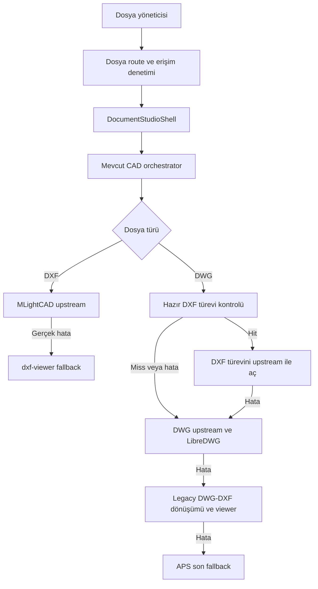

# 02 — Yerel repo incelemesi ve başlangıç kanıtı

> **Araştırma katmanı:** Bu belgedeki alternatifler ve öneriler Gemini için seçim yetkisi değildir. Kullanıcının son talimatıyla [00 — EXEC-2](00_BAGLAYICI_UYGULAMA_KARARLARI.md) ve [19 — sabit uygulama sırası](19_GEMINI_ADIM_ADIM_UYGULAMA.md) geçerlidir. Çelişen seçim/scope ifadeleri tarihsel araştırma olarak kalır; Gemini uygulamaz.

[Dizin](README.md) · [Entegrasyon](09_SITE_ENTEGRASYONU.md) · [Ham envanter](arastirma/yerel-corpus.json)

**İnceleme tarihi:** 05.09.2026. Yerel branch `main`, HEAD `042b04a96300c6e2d4f44593fdab33eb7cd8593c`. Yerel `main` aynı committe. Remote fetch, GitHub write ve canlı Vercel doğrulaması yapılmadı; bu belge mevcut yerel checkout'ı tarif eder.

Başlangıçta `docs/cad-dxf-engine/CAD_ENGINE_ACCELERATION_PROPOSAL.md` untracked olarak vardı. Başka çalışmaya ait bu dosya okundu, değiştirilmedi. Eski raporların süreleri bu oturumda ölçülmüş gibi kullanılmadı.

## İncelenen bağlam

[PROJECT.md](../PROJECT.md), [AGENTS.md](../AGENTS.md), [CAD koruma kuralı](../.agents/rules/cad-dxf-engine-koruma.md), [test standardı](../.agents/rules/test-ve-otomasyon-standardi.md), [dokümantasyon kuralı](../.agents/rules/dokumantasyon-kurallari.md), [yaşayan dokümantasyon kuralı](../.agents/rules/yasayan-dokumantasyon-bakimi.md), [bağlam haritası](../DOK_CONTEXT_MAP.md), [mimari hafıza](../docs/DOKUMANTASYON_CAD_MIMARI_HAFIZA.md) ve [motor koruma belgeleri](../docs/cad-dxf-engine/README.md) değerlendirildi.

Repo Next.js 16.1.6, React 19.2.3, TypeScript ve Tailwind 4 kullanıyor. `package.json` içindeki doğrudan CAD sürümleri `@mlightcad/cad-simple-viewer 1.6.2`, `@mlightcad/data-model 1.14.2`, `@mlightcad/libredwg-converter 3.14.2`; `dxf-viewer` aralığı `^1.0.48`. Bunlar araştırılan upstream HEAD'leriyle aynı kabul edilmez.

## Bugünkü açılış hattı

Kaynaklar: [orchestrator](../src/components/dokumantasyon/preview/cad-runtime-orchestrator.tsx), [Studio](../src/components/dokumantasyon/studio/document-studio-shell.tsx), [dosya sayfası](../src/app/dokumantasyon/dosya/%5BfileId%5D/page.tsx).

**Belge/kod farkı:** Mimari hafızanın 4.1 bölümünde cached DXF için `DokCadViewer` yazıyor; güncel orchestrator'ın `fast-upstream` dalı `DokCadUpstreamViewer` çağırıyor. Plan güncel kaynak kodu esas alır. Bu araştırma çalışan sistemi değiştirmediği için mevcut yaşayan belgeye müdahale edilmedi; entegrasyon sırasında fark düzeltilmeye adaydır.

## V2 için somut temas noktaları

| Alan | Gerçek dosya | Gözlem ve gelecekteki seçenek |
|---|---|---|
| Liste ve grid üç nokta menüsü | [file-manager.tsx](../src/components/dokumantasyon/file-manager.tsx) | İki ayrı dosya menüsünde “Önizle / Studio” var; ikisine V2 seçeneği eklenebilir |
| Ortak komutlar | [command-registry.ts](../src/components/dokumantasyon/drive-v3/command-registry.ts) | `open`, `preview` mevcut; ayrı `open-cad-v2` eklenebilir |
| Yetkili dosya açma | [page.tsx](../src/app/dokumantasyon/dosya/%5BfileId%5D/page.tsx) | `getAdminFileAccess`; şu anda `searchParams` sözleşmesi yok |
| Viewer seçimi | [document-studio-shell.tsx](../src/components/dokumantasyon/studio/document-studio-shell.tsx) | CAD dynamic import mevcut orchestrator'a gidiyor; üstte ayrı V2 seçimi mümkün |
| Diğer preview yüzeyi | [file-preview-shell.tsx](../src/components/dokumantasyon/preview/file-preview-shell.tsx) | CAD orchestrator çağrısı ve kaynak sürüm anahtarı var |
| Paylaşım | [public route](../src/app/p/%5Btoken%5D/page.tsx) | Ayrı share akışı; admin erişimi public yetki yerine kullanılamaz |
| Erişim URL yenileme | Studio içindeki `currentLease` | V2 de URL ömrünü dosya kimliğiyle karıştırmadan tüketebilir |
| Asset üretimi | [sync scripti](../scripts/sync-cad-upstream-assets.mjs) | Mevcut worker/WASM/font yolunu koruyup V2 için ayrı asset alanı seçilebilir |

## Zaten var olan performans yatırımı

- DWG input `ArrayBuffer` kurulu worker yöneticisinde transfer listesiyle gönderiliyor. “İlk kez zero-copy ekleme” kazanımı yazılamaz.
- Kurulu native DXF converter `useWorker:false` ve cooperative yield kullanıyor. DXF'nin bütününün zaten worker içinde olduğunu varsaymak da, native okuyucunun dev bir JSON ara modeli ürettiğini varsaymak da yanlış olur.
- LibreDWG converter parser worker API'sini oluşturuyor, `execute` sonrası `destroy` ediyor; çıktı worker tarafında sıradan `postMessage(response)` ile iletiliyor. Çıktı kopyalama ve veritabanına dönüştürme maliyeti ayrı ölçülebilir.
- [Adapter](../src/lib/dokumantasyon/cad-upstream/adapter.ts) içinde worker/source/font hazırlığını örtüştüren işler var. Host'un `create()` ve ardından `open()` sırası nedeniyle tüm startup'ın paralel olduğu sonucu çıkmaz.
- [Session cache](../src/lib/dokumantasyon/cad-runtime/session-cache.ts) kaynak baytlarını RAM'de tutuyor: 3 giriş, toplam 40 MiB, tek dosya 20 MiB. Bu hazır GPU sahnesi cache'i değil.
- [Performans oturumu](../src/lib/dokumantasyon/cad-runtime/perf.ts) host startup içinde başlatılıyor; dosyaya tıklamadan itibaren uçtan uca süre için dış ölçüm gerekebilir.
- [Mevcut benchmark](../tests/document-studio/cad-perf-baseline.spec.ts) bazı ağ boyutlarını `Content-Length` üzerinden topluyor. Bu tek başına gerçekten transfer edilen gövde baytlarının ölçümü değil.

Kurulu `node_modules` kaynaklarında bunların temsilî çağrıları incelendi; temiz kurulumla yeniden üretilebilirlik bu oturumda sınanmadı. [Mevcut hızlandırma önerisi](../docs/cad-dxf-engine/CAD_ENGINE_ACCELERATION_PROPOSAL.md) ek deney fikirleri içeriyor; bu ayrı V2 işi mevcut motor optimizasyonuna dönüşmemeli.

## Gerçek dosya envanteri

Dosyaların tamamı yerelde kaldı. DWG için başlık ve hash; DXF için group-code kayıt taraması ve tam dosyada geçerli UTF-8 kontrolü yapıldı. Görüntüleme, semantik parse veya font görünüşü doğrulaması yapılmadı.

| Kimlik | Yerel dosya | Bayt | Bulgu |
|---|---|---:|---|
| R001 | `1 ve 2.kat dwg.dwg` | 3.444.087 | DWG başlığı AC1032 |
| R002 | `kiris_acilimlari_tum_katlar.dwg` | 2.139.550 | DWG başlığı AC1032 |
| R003 | `MUSTAFA SELVİ 1.KISIM STATİK.dwg` | 16.084.252 | DWG başlığı AC1032 |
| R004 | `SÜHEYLA KARA STATİK (HAFİF).dxf` | 55.259.742 | AC1021; tüm bayt akışı geçerli UTF-8 |

R004 başlığında `$DWGCODEPAGE=ANSI_1254`, `$INSUNITS=5`, `$MEASUREMENT=0` bulunuyor. **Codepage etiketi gerçek bayt kodlaması yerine tek başına kullanılmamalı.** R2007/AC1021 ve sonrası için UTF-8 kuralı ile dosyanın gerçek bayt geçerliliği birlikte değerlendirilmeli. [ezdxf kodlama belgesi](https://ezdxf.readthedocs.io/en/stable/drawing/management.html).

R004 kayıt sayımları:

| Kayıt | ENTITIES bölümü | BLOCKS bölümü |
|---|---:|---:|
| LWPOLYLINE | 73.960 | 54.790 |
| TEXT | 27.830 | 25.617 |
| MTEXT | 16 | 477 |
| ARC | 10.293 | 4.148 |
| CIRCLE | 18.676 | 5.024 |
| HATCH | 984 | 232 |
| DIMENSION | 9 | 276 |
| INSERT | 13 | 1.552 |
| OLE2FRAME | 1 | 0 |

BLOCKS içinde ayrıca 303 `BLOCK` kaydı var. Bunlar **ekranda görünen veya INSERT açılımından sonraki entity sayıları değildir**; kullanılmayan tanımlar, iç içe instance'lar ve yapısal kayıtlar ayrıştırılmadı. Toplam group-code çift sayısı 3.968.453. Bu envanter, metin/yay/polyline/blok performansının ilk deneylerde bulunmasını gerekçelendirir; dosyanın doğru açıldığını kanıtlamaz.

## Koruma ve doğrulama izi

Tarihsel golden `909c59cb9dcac8e722b3bda4c66fd9d8a25755c8` ve restore `afbc121923f2de1313801f884f428535334a40cf` korunuyor. **Güncel HEAD'i golden'a topluca döndürmek bu görevin parçası değil.** Yeni çalışma için karşılaştırma başlangıcı güncel checkout olur.

| Core dosya | İnceleme başındaki Git blob |
|---|---|
| cad-runtime-orchestrator.tsx | `5ab11bd957b02e5348a02c172510cb24be30c73f` |
| cad-upstream-viewer.tsx | `b102b4b8d64b372c31b9abca4faee6c9f62dd839` |
| cad-viewer.tsx | `93c5e3db2ee3bd41eadc34f4f4f38600ca738d2c` |
| dxf-viewer-worker.ts | `4b43906928bfcb31d71038b01927d018022cad11` |

[Başlangıç JSON'u](arastirma/yerel-baslangic.json) ayrıca SHA-256 kayıtlarını içerir. `vercel.json` yalnız framework/install/build ayarlarını içeriyor; yeni CAD servis ayarı yok. `.vercelignore` tests ve araç klasörlerini dışlıyor. Üretim kodu ileride test fixture'larına import ile bağlanmamalı. Bu oturum build veya asset sync çalıştırmadı.
