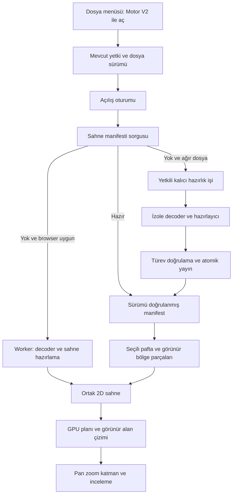

# 05 — Önerilen sistem mimarisi ve sözleşmeler

> **Araştırma katmanı:** Bu belgedeki alternatifler ve öneriler Gemini için seçim yetkisi değildir. Kullanıcının son talimatıyla [00 — EXEC-2](00_BAGLAYICI_UYGULAMA_KARARLARI.md) ve [19 — sabit uygulama sırası](19_GEMINI_ADIM_ADIM_UYGULAMA.md) geçerlidir. Çelişen seçim/scope ifadeleri tarihsel araştırma olarak kalır; Gemini uygulamaz.

[Dizin](README.md) · [Doğruluk](06_DOGRULUK_ATLASI.md) · [Performans](07_PERFORMANS_VE_BELLEK.md) · [İşletim](10_GUVENLIK_VE_ISLETIM.md)

Bu tasarım bir başlangıç adayıdır. API isimleri, klasörler ve şema taslakları mevcut uygulamada bulunmuyor. En küçük anlamlı prototipte doğrulandıktan sonra ayrıntıları sabitlenebilir.

## Uçtan uca akış



İlk sürüm bu akışın tek bir dalını uygulayabilir. Aynı dosya için her iki decoder'ı aynı anda başlatmak varsayılan davranış olmaz. V2 başarısızlığında mevcut motor ayrı kullanıcı seçeneği olarak açılabilir; geçişten önce oturum kaynakları temizlenir.

## Modül sahipliği

| Katman | Sorumluluk | Dışarı verdiği sonuç |
|---|---|---|
| Host/UI | Yetkili kaynak, route, aç/kapat, panel ve giriş | Açılış isteği, kamera/katman komutları |
| Source resolver | Kaynak sürümü, bağımlılıklar, indirme/lease | Kimliği belli byte akışı ve dependency manifest |
| Decoder adapter | Formatı okuma, nesne tablosu ve kaynak anlamı | Semantik kayıtlar ve decoder diagnostics |
| Normalizer | Koordinat, style inheritance, layout, instance kimliği | Canonical CAD sahnesi |
| Scene compiler | Eğri, stroke, hatch, metin yerleşimi ve indeks | Render planı, parça dizini, kalite bilgisi |
| Runtime scheduler | Görünür bölge, işi dilimleme, backpressure | Bütçeli CPU/GPU görevleri |
| Renderer | Kamera, draw order, clip, buffer/texture yaşamı | Gerçek çizim ve frame ölçümleri |
| Quality ledger | İçerik kapsaması ve hata/proxy kayıtları | Dosya/pafta/bölge kalitesi |
| Cache/derivative | Versioned hazırlık sonucu | Atomik ve tekrar okunabilir scene |

UI'nin her entity için React bileşeni üretmesi önerilmez. React dosya ve araç durumunu yönetir; yüksek frekanslı kamera ve GPU buffer state'i motor içinde kalabilir.

## İki veri düzeyi

**Canonical sahne:** Kaynağın mühendislik anlamını korur: Float64 koordinatlar, yay/spline parametreleri, entity handle, blok tanımı ve instance yolu, layer/style, metin içeriği, dimension'ın kaynak görünüşü, layout/viewport, units ve diagnostics. Measurement/search gibi özelliklerin dayanağı budur.

**Render planı:** Ekran için türetilmiştir: yerel koordinatlarda Float32 vertex verisi, index buffer, glyph/stroke atlas referansları, clip komutları, order aralıkları ve LOD. Bu düzey yeniden üretilebilir ve gerektiğinde RAM/GPU'dan atılabilir. Render polyline'ı kaynak spline'ın veya kesin ölçümün yerine geçmez.

İlk prototipte semantic ve render verisini tek yapı içinde tutmak daha basitse mümkün; fakat hassasiyet ve provenance sınırı kaybolmamalı. Bütün canonical verinin mobil main thread RAM'inde bulunması şart değil: aktif bölgeye ait kesin geometri worker/cache/server üzerinden getirilebilir.

## Kimlik ve bağımlılık modeli

Kaynak kimliği signed URL değildir. Öneri: `tenant/access scope + fileId + immutable revision + content SHA-256`. Türevin kimliği buna decoder build'i, normalizer/scene şema sürümü, font dosya hash'leri, XREF sürümleri, kaynak yorumlama ayarları ve tolerans profilini ekleyebilir.

Blok içindeki entity handle tek başına bir görünen nesneyi tanımlamaz. Aynı tanım bin kez INSERT edilebilir. Önerilen instance kimliği: `sourceRevision + xrefPath + blockInstancePath + entityHandle`. Seçim, diagnostik ve ölçüm aynı kimliği kullanabilir.

XREF grafiğinde her node'un erişim kararı ve sürümü ayrı tutulur. Relative path kullanıcı projesindeki izinli dosyayla eşlenir; rastgele URL veya sunucu disk yolu olarak açılmaz. Bir alt çizim ya da font değişirse bağımlı türev yeni kimlikle üretilir.

## Decoder adapter taslağı

```ts
// Öneri; kurulu SDK API'si değildir.
interface DecoderProfile {
  id: string;
  build: string;
  formatFamilies: readonly string[];
  supportsBinaryDxf: boolean;
  outputMode: "semantic" | "vectorized" | "hybrid";
}

interface CadSourceIdentity {
  fileId: string;
  revision: string;
  sha256: string;
  accessScope: string;
}

interface DecodeRequest {
  sessionId: string;
  source: CadSourceIdentity;
  signal: AbortSignal;
  budget: { maxDecodedBytes: number; maxWorkMs: number };
}
```

`AbortSignal` worker'a doğrudan bu şekliyle gönderilmez; host sözleşmesidir. Worker mesajlarında session ID ve ayrı iptal komutu kullanılabilir. Decoder tek bloklayan native/WASM çağrısıysa mesajla iptal hemen işlenmeyebilir; süreç/worker sonlandırma ve temiz yeniden oluşturma yolu gerekir.

Decoder hazır vektör primitive'leri veriyorsa entity özelliği, metin içeriği, layer ve kaynak kimliği korunma düzeyi incelenir. Yalnız SVG/PDF görüntüsü veren bir yol interaktif ölçüm/katman hedefiyle aynı yeteneğe sahip sayılmaz. DWG → DXF ara adımı kullanılabilir ama boyut, süre ve anlam kaybı doğrudan sahne çıkışıyla karşılaştırılır.

## Sahne manifesti taslağı

```json
{
  "schema": "cad-scene/1",
  "sourceRevision": "immutable-version",
  "sourceSha256": "64-hex",
  "decoderBuild": "provider@pinned-build",
  "compilerBuild": "scene-compiler@build",
  "dependencyDigest": "64-hex",
  "units": { "sourceCode": 0, "resolved": null },
  "layouts": [],
  "chunks": [],
  "quality": { "status": "unverified", "issues": [] }
}
```

Her chunk tanımı öneri olarak `id`, `kind`, `layoutId`, `bounds64`, `origin64`, `orderRange`, `clipScope`, `byteLength`, `decodedByteLength`, `sha256`, `dependencies`, `lod` içerebilir. Manifest içindeki schema/string/array alanları ve chunk sayısı da limitlenebilir. Örnekteki boş diziler destek tamamlandı anlamına gelmez.

Dosya formatı başında magic, major/minor schema, endian, header boyu, section sayısı, offset/length ve checksum düşünülebilir. Offset+length taşması, bölüm çakışması, alignment, maksimum entity count ve açı/koordinatın finite olması okunurken doğrulanır. JSON manifest + bağımsız binary chunk yaklaşımı range/CORS karmaşıklığını azaltabilir; tek paket+HTTP Range daha sonra ölçülebilir.

Compression browser worker'da açılabilir; encoded boyut küçük diye decoded allocation sınırsız bırakılmaz. Cache'e indirilen yarım parça ready görünmez. Yeni manifest ancak bütün zorunlu parçalar ve checksum'lar doğrulandıktan sonra atomik görünür olur.

## Çalışma yaşam döngüsü

Önerilen üst durumlar:

```text
idle → authorizing → resolving → fetching/preparing
     → partial → ready
     → degraded / unsupported / failed / cancelled
her aktif durum → disposing → disposed
```

`partial`: kullanılabilir geometri var fakat içerik henüz tamamlanmadı. `ready`: ilan edilen profilin gerekli içeriği hazır ve kalite kaydı bunu doğruluyor. `degraded`: eksik font/nesne/bağımlılık veya kalite düşüşü var. `unsupported`: bu motor bu profil için yeterli değil. İptal ayrı durumdur; fallback hata sayacı artırılmaz.

### Dosya değişimi ve geç gelen sonuçlar

A dosyası açılırken B seçilirse yeni session/generation oluşturulur. A'nın indirmesi, parse'ı veya glyph sonucu daha sonra gelse bile B'nin state'ine uygulanmaz. Her async boundary'de session kimliği kontrol edilebilir. Kaynak lease yenilenmesi aynı revision'ı temsil ediyorsa oturum korunabilir; revision değişirse kontrollü yeni açılış gerekir.

### Backpressure

Worker renderer'ın tüketebileceğinden hızlı veri üretirse biriken mesajlar RAM'i şişirir. Öneri: parça/byte kredi sistemi. Host en fazla örneğin birkaç hazır chunk ve belirli byte bütçesi kabul eder; GPU yüklemesi veya cache yazımı bitince kredi iade eder. Kamera değişince offscreen refinement'ın önceliği düşer. Önce seçili pafta ve viewport içi gerekli içerik hazırlanır.

### Kaynak sahipliği

Transfer edilen ArrayBuffer'ın gönderen tarafta kullanılamayacağı hesaba katılır. Renderer'a verilen buffer'ın canonical kopya mı, sahipliği devredilen render verisi mi olduğu sözleşmede bellidir. WASM heap view'ları memory growth sonrası geçersizleşebilir; native pointer/JS view yaşamı bağlanır. [Transferable nesneler](https://developer.mozilla.org/en-US/docs/Web/API/Web_Workers_API/Transferable_objects).

### Kapatma

Fetch/reader iptali, worker terminate/lease release, RAF ve timer iptali, listener/observer kaldırma, GPU buffer/texture/program silme, object URL revoke, pointer capture bırakma ve bekleyen cache işlemlerini sonlandırma tek idempotent `dispose()` yaşamında toplanabilir. Geç gelen callback'ler disposed nesneye erişmez. Mevcut motorla global singleton, monkeypatch veya ortak worker isimleri paylaşılmaz.

## Hazır sahnenin server yaşamı

Öneri: `queued → running → validating → ready`, alternatifler `retryable-failed`, `permanent-failed`, `cancelled`, `expired`. İş kimliği kaynak ve dependency digest + compiler build üzerinden idempotent oluşturulabilir. İşçi lease/heartbeat ile sahiplik alır; ölürse bounded retry uygulanır. Yeniden başlayan iş eski yarım output'u ready yapmaz.

Upload finalization'a kalıcı hook bağlamak ilk prototipin şartı değildir. Önce V2'de açıkça istenen dosya için idempotent hazırlık işi denenebilir. Daha sonra kullanılan dosyaları önceden hazırlama ekonomik bulunursa eklenir. Queue zamanı ve compilation zamanı kullanıcıya ayrılır; DB satırı veya dosya upload başarısı sahne hazırlık başarısı sayılmaz.

## Önerilen uygulama alanları

```text
src/lib/cad-v2/             # semantik, math, scene, cache, diagnostics
src/components/cad-v2/      # bağımsız host, kontroller, paneller
src/workers/cad-v2/         # decoder/compiler worker entry
public/cad-v2/<build>/      # sürümü sabit worker/WASM/font assetları
tests/cad-v2/               # yeni testler ve fixture metadata
services/cad-v2-compiler/   # yalnız server yolu seçilirse
```

Bunlar örnek isimlerdir. Yeni workspace/monorepo ilk günden şart değildir. Ama V2 kodunun mevcut adapter/worker'ın global çalışma durumuna bağlı olmaması, iki motoru bağımsız kullanma hedefini destekler.
