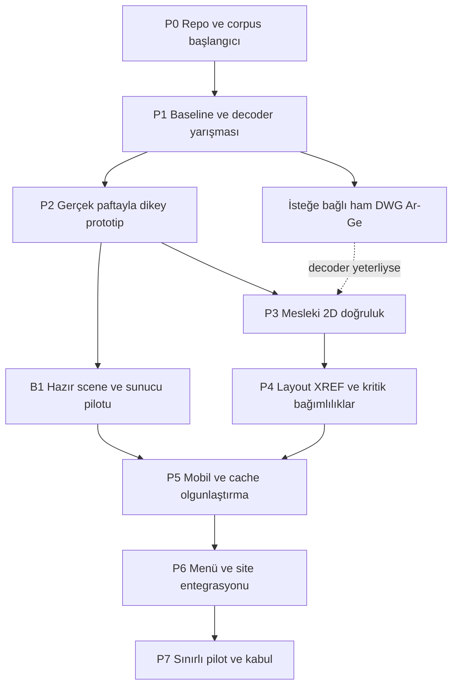

# 12 — Birbirine bağlı yol haritaları

> **Araştırma katmanı:** Bu belgedeki alternatifler ve öneriler Gemini için seçim yetkisi değildir. Kullanıcının son talimatıyla [00 — EXEC-2](00_BAGLAYICI_UYGULAMA_KARARLARI.md) ve [19 — sabit uygulama sırası](19_GEMINI_ADIM_ADIM_UYGULAMA.md) geçerlidir. Çelişen seçim/scope ifadeleri tarihsel araştırma olarak kalır; Gemini uygulamaz.

[Dizin](README.md) · [İş paketleri](13_IS_PAKETLERI.md) · [Risk ve kaynak](14_KAYNAK_VE_RISK_PLANI.md) · [Astra devri](15_ASTRA_CALISMA_REHBERI.md)

Sıra, teknoloji ve eşikler öneridir. Amaç her fazda ayrı onay beklemek değil; belirsizlikleri erken çözerek kullanıcının yetkilendirdiği kapsam içinde ilerlemek. Bu oturumun kapsamı araştırma/plan teslimidir; aşağıdaki uygulama işleri henüz yapılmadı.

## Ortak başlangıç ve bağımlılıklar

UI menüsünün maketi P1 sırasında hazırlanabilir; çalışan kullanıcı seçeneğine bağlanması yeterli vertical slice sonrası önerilir. Mobil denemeler P2'de başlar; P5'e kadar bekletilmez. Lisans ve font erişimi P1'de başlar; son release'e bırakılmaz.

## P0 — Başlangıç kanıtı

**Girdi:** Bu paket, güncel repo ve gerçek dosyalar. **İş:** HEAD/diff/dependency/asset fingerprint, korunacak dört core dosya, başlangıç corpus ve temel özellik tablosu. Kullanıcının örnekleri için reference application ayarlarını ve yasal font/XREF dosyalarını hazırlama.

**Çıktı:** Tek başlangıç manifesti ve test ortamı. Bu araştırmada kaynak envanteri kısmen hazır; AutoCAD görsel referansları, runtime baseline ve cihaz listesi henüz yok.

**İlerleme kanıtı:** Test verisi kullanıcı storage'ından izole; legacy açılışı tekrar üretilebilir; mevcut rapor ile güncel HEAD farkı belli.

## P1 — Baseline ve decoder yarışması

**İş:** R001–R004'te legacy soğuk/sıcak açılışı ölç; en az iki uygulanabilir decoder yolundan temel geometri, text, dimension, layout ve warning çıkar. Ücretli trial erişimi yoksa açık kaynak adaylarıyla devam et; erişilmemiş adaya skor uydurma.

**Çıktı:** Decoder kapsama tablosu, ham süre/bellek kayıtları, lisans/dağıtım notu, seçilen ilk yol için ADR.

**İlerleme kanıtı:** En az bir aday kaynak anlamını yeterli çıkarabiliyor. İki aday da kritik içeriği kaybediyorsa server/commercial yol veya kaynak uygulama export'u araştırılır. Yalnız parse hızına göre kazanan seçilmez.

## P2 — Gerçek paftayla dikey prototip

**İş:** Byte → decode → canonical → render plan → GPU → pan/zoom → dispose. İlk günlerde basit fixture'larla geometri; aynı faz içinde gerçek R002/R001 ve büyük R004 alt profili. Metin ve en az bir zor feature erken görünür.

**Çıktı:** İzole geliştirme viewer'ı; source provenance ve kalite paneli; temel event/timing sözleşmesi.

**İlerleme kanıtı:** Temel fixture oracle'ları, gerçek çizimde tanımlı ROI, ilk gerçek telefon denemesi, 20 aç/kapat ve iptal çalışıyor. Sadece milyon LINE demosu bu fazı tamamlamaz.

**Mimari geri besleme:** Packed scene yavaş/büyükse şema değişebilir; Rust zorunlu değil. Browser heap yetmiyorsa B1 erkene alınır.

## P3 — Mesleki 2D doğruluk

**İş:** TEXT/MTEXT/SHX, blok/attrib/OCS, dimension, hatch, lineweight/linetype, draw order/wipeout; desteklenmeyen kaydı ve exact/degraded ayrımı. Geometri işinde profiling ve kademeli optimization.

**Çıktı:** Özellik başına PASS/DEGRADED/NOT RUN matrisi ve minimize regression fixture'ları.

**İlerleme kanıtı:** Hedef corpus'ta kritik yazı/ölçü kaybı yok; kalıcı LOD kaybı yok; decoder→scene→render uyuşmazlıkları çözüldü veya sınırlama açık. Eksik OLE/proxy dosyası tam uyumlu profile dahil edilmez.

## P4 — Pafta ve proje bağımlılıkları

**İş:** Model/layout switch, çoklu viewport, twist/clip/frozen layers, XREF graph, image/underlay, annotation context. Kaynak uygulama paftasının birkaç kritik crop'u bağımsız karşılaştırılır.

**Çıktı:** Pafta profili, dependency manifesti, cache invalidation örneği.

**İlerleme kanıtı:** Bir XREF veya font sürümü değişince yeni türev üretiliyor; eksik dosya doğru belirtiliyor; iki viewport'ta görünür layer farklılıkları doğru. 3D araçlar eklenmeden bu aşama tamamlanabilir.

## P5 — Cihaz, performans ve cache

**İş:** Mobil budget, scene streaming, backpressure, cold/warm/cross-device ölçüm, quota/cache recovery, worker/GPU lifecycle ve network loss. WebGPU/OffscreenCanvas ancak ölçülen bir fayda ihtiyacı varsa ayrı deney.

**Çıktı:** Gerçek cihaz matrisi, kaynak sınıfı bazında hız/bellek sonuçları, benchmark ham veri ve bilinen sınırlar.

**İlerleme kanıtı:** Tanımlı kalite eşliğinde legacy karşılaştırması anlamlı; iOS/Android gerçek cihaz kanıtı var; ağır dosya desteklenemediğinde açık bounded yol var. Genel “mobil geçti” yerine cihaz bazlı sonuç.

## P6 — İki motorun birlikte kullanımı

**İş:** [Entegrasyon planındaki](09_SITE_ENTEGRASYONU.md) menü, command, allowlist route, dynamic host, kaynak lease ve engine kimliği. Public share gerekiyorsa ayrı alt etap.

**Çıktı:** Dosya üç noktasından çalışan V2; mevcut görüntüleyici komutu ve kill switch.

**İlerleme kanıtı:** Normal açılış aynı; legacy core dört dosya korunmuş; PDF/DWF etkilenmemiş; yetki ve cache erişimi kontrol edilmiş; V2 bundle varsayılan akışa yük olmuyor.

## P7 — Pilot ve ürün seçeneği

**İş:** Sınırlı gerçek kullanım, holdout corpus, fault injection, bağımlılık/lisans/asset zinciri ve Linux build kontrolü. Kullanıcı geri bildirimiyle görünüş ve etkileşim detayları düzeltilir.

**Çıktı:** Profil/cihaz kapsamı belli release raporu, işletim/rollback notu ve yaşayan repo belgelerinin güncel hali.

**İlerleme kanıtı:** [Kabul programının](11_DOGRULAMA_PROGRAMI.md) ürün seçeneği düzeyi. V2 varsayılan motor yapılmaz; iki motor menüden kullanılmaya devam eder.

## B — Ağır dosya için hazır sahne alt yolu

**B1:** Aynı sahne compiler'ını kontrollü yerel server process'inde çalıştır; tek gerçek pafta için manifest/chunk üret. İlk hazırlık süresi ve çıktı boyutunu kaydet.

**B2:** Yetkili source revision → idempotent job → staging → validation → ready pointer akışı. DB/storage mevcut sözleşmeye bağlı; decode ayrı worker'da.

**B3:** Aynı projeyi ikinci gerçek telefonda kaynak DWG/DXF indirmeden gerekli scene parçalarıyla aç. Ölçülen transfer ve fidelity karşılaştırması.

**B4:** Retry, worker death, stale source, permission revoke, cleanup, quota ve maliyet sınırları. Upload sonrası ön hazırlık ancak usage/compute dengesi ölçülürse eklenebilir.

B yolunun eleme koşulu: scene büyümesi/ilk hazırlık kuyruğu/altyapı maliyeti kullanıcı faydasını aşarsa browser yolu öne alınır. Kalite ve repeat kullanım kazancı güçlüyse ağır dosyanın ana V2 yolu olabilir.

## C — Hazır SDK viewer alt yolu

Trial sandbox'ında aynı corpus ve cihazlarla hazır viewer ölçülür. UI/menü kullanıcı ihtiyacını karşılayabiliyorsa ve lisans uygunsa özel renderer yazımının toplam maliyetiyle kıyaslanır. Ürüne sahip olmak için her render satırını yazmış olmak gerekmez. C seçilirse bu paketin auth, kalite, corpus, rollout ve iki motor tasarımı yine kullanışlıdır.

## D — Gerçekten sıfırdan DWG decoder Ar-Ge'si

Bu yol ayrı finansman ve uzun bakım isteğine bağlı bir öneridir. İlk hedef bütün tarihsel sürümler yerine yerel örneklerin AC1032 ailesi olabilir; eski aileler sonraki bağımsız uyumluluk dilimleri olur.

1. **Kaynak ve hak haritası:** Resmi/açık spesifikasyon, gözlenebilir dosya davranışı ve lisanslı referans araçları belirle. Başka lisanslı koddan kopyalanan bir uygulamaya “tamamen özgün” etiketi verme.
2. **Binary primitives:** Bit reader, sayı/string kodları, sınır kontrollü offset/length, checksum ve hata raporu için byte-level testler.
3. **Container ve sections:** AC1032 dosya bölümleri, page/section çözümleme ve gerekli sıkıştırma; bozuk/truncated girdilerde bounded davranış.
4. **Handle/object/class grafiği:** Nesne sınırları, referanslar, string stream ve owner ilişkileri. 64-bit handle'ları JS Number'a kayıplı çevirmeme; string/BigInt veya iki-word temsil değerlendirmesi.
5. **Tables ve temel 2D:** Header, layer/style/linetype/block ve geometry extraction; unknown nesne güvenli skip/diagnostic.
6. **Mesleki semantik:** Metin, dimensions, hatch, layout, proxy ve dependency verisi. Her yeni entity için native referans ve byte fixture.
7. **Differential/fuzz:** İki bağımsız okuyucuyla numeric/property comparison; sanitizer, memory/time budget, crash minimization; geri bildirimle kapsama artışı.
8. **Ürün adapter'ı:** Ancak aynı corpus'ta mevcut decoder'ın kalite/stabilitesine ulaştığında V2'ye aday olarak bağlama. Başarısız sınıflar açık kalır.

ODA'nın açık DWG belgesi sürüm 5.4.1, 1998–2018 telif tarihli ve 279 sayfalık bir teknik kaynaktır; bit kodları, format organizasyonları, nesneler ve proxy grafik bölümleri içerir. Tek başına güncel tüm davranışın eksiksiz veya kullanım haklarının sınırsız olduğu garantisi değildir. [Spesifikasyon](https://www.opendesign.com/files/guestdownloads/OpenDesign_Specification_for_.dwg_files.pdf).

**D yolunun kritik ayrımı:** 3D render yapılmaması binary container ve ortak nesne altyapısını yok etmez. Renderer'ın 2D olması kapsamı daraltır; decoder'ın bilinmeyen 3D/özel nesneleri güvenli biçimde tanıyıp sınırlarından geçebilmesi hâlâ gerekebilir.

## Sıralama için karar cümlesi

İlk önerim **P0–P2 ile sonucu ölç, P3/P4'te mesleki doğruluğu kur, B'yi ağır dosya kanıtına göre erkene çek, P6/P7'de bağımsız seçenek olarak sun**. D'nin araştırılması A/B/C'nin kullanıcıya değer vermesini bekletmeyebilir. Her fazın sonunda yeniden plan yapmak serbesttir; kanıtla elenen fikri korumak zorunlu değildir.
