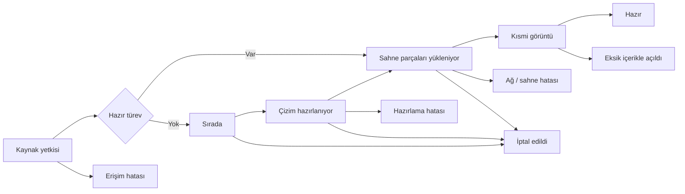

# 22 — Ekran senaryoları ve görsel kabul

[Dizin](README.md) · [Tasarım sistemi](21_ARAYUZ_TASARIM_SISTEMI.md) · [Görsel kanıt şablonu](sablonlar/GORSEL_KANIT.md)

**UI kimlikleri EXEC-2 kabul maddeleridir.** Maket, test fixture'ı ve gerçek V2 ekranı ayrı kaydedilir. İlk tasarım prototipi hiçbir gerçek dosya açtığını iddia etmez. Son kabulde aynı yüzeyler gerçek API/worker/scene akışına bağlanmış olmalıdır. Gemini görsel tercihleri değiştiremez veya yalnız ana ekrana bakarak tasarımı tamamlandı sayamaz.

## Görünür durum makinesi

Buradaki R yalnız tanımlı görünür içeriğin ve kritik font/dependency'lerin doğrulandığı son durumdur. Kısmi görüntü gösterilirken tüm proje hazır rozeti basılmaz. GPU context kaybı ayrıca toparlanıyor → hazır/hata yoludur; dosya hazırlığı baştan başlamaz. Hata/iptal UI kontrolü decoder'dan gelecek bir Promise'in sonsuza kadar bitmesini beklemez.

## Ekran sözleşmeleri

| ID | Senaryo | Görünür içerik / eylem | Kabulde özellikle bakılacak |
|---|---|---|---|
| UI01 | Masaüstü ana ekran | Gerçek çizim, kısa üst bar, araç satırı, nötr V2 kimliği | Çizim baskın; ikinci app navbar'ı, dashboard kartı ve sahte ölçüm aracı yok |
| UI02 | Koyu/açık tema | Aynı dosya/kamera iki temada | Yazı/ikon/focus kontrastı; kaynak CAD renkleri tema filtresiyle bozulmaz |
| UI03 | Telefon portre | Kısa üst bar + pafta + dört araçlı alt dock | 320/390/430 px; safe area; uzun ad; hiçbir ana eylem hover'a bağlı değil |
| UI04 | Telefon yatay | Çizim odak görünümü ve erişilebilir çıkış | 844×390; browser bar değişimi; kontrol yığını çizimi boğmuyor |
| UI05 | Tablet | 768×1024 ve 1024×768; katman paneli açık/kapalı | Touch hedefleri, çizim alanı ve panel değişirken kamera aynı |
| UI06 | Sırada/hazırlanıyor | “Çizim hazırlanıyor”/“Sırada”, geçen süre, İptal | Ölçülmeyen sıra numarası/ETA/% yok; spinner sonsuz kalmıyor |
| UI07 | Kısmi görüntü | Çizim kullanılabilir; “Görünüm yükleniyor” durumu | Yüklenmeyen bölge tanımlı, yanlış tam başarı ve ölçüm kesinliği yok |
| UI08 | Eksik font/XREF | “Bazı içerikler eksik” ve Ayrıntılar | Etkilenen font/dosya/özellik erişilebilir listede; teknik stack trace ana ekranda yok |
| UI09 | Hata | Anlaşılır neden; uygunsa Tekrar dene; mevcut görüntüleyici ve geri | Yetki/format/ağ/bellek ayrı; her hatada anlamsız retry yok |
| UI10 | İptal | “Açma işlemi iptal edildi”; Yeniden aç / Geri | Otomatik fallback/decode tekrar başlamıyor; önceki çizim yeni dosya gibi görünmüyor |
| UI11 | Katmanlar | Arama, checkbox, kaynak swatch/name, görünür sayı | Uzun ad, 10.000 sentetik satır, no-result, tümünü göster; bounded DOM |
| UI12 | Paftalar | Gerçek kaynak adları, Model, arama ve seçili durum | Pafta geçişi, frozen layer/clip; referans kamera; keyboard çalışıyor |
| UI13 | Görünüm | Zemin, kaynak renkleri/tek renk, lineweight | Ayar sadece display; source ve canonical değişmiyor; tema parity |
| UI14 | Daha fazla / legacy geçişi | Mevcut görüntüleyiciyle aç, İndir, izinli Paylaş | Menü viewport dışında değil; açık motor kimliği; kapanış cleanup |
| UI15 | Boş dosya / boş görünüm | “Bu görünümde çizim bulunamadı”; Sığdır/Katmanlar/Pafta | Boş viewport ile tüm dosyanın boşluğu ayrılıyor; yanlış parse hatası yok |
| UI16 | Ağ kopması / erişim süresi | Görünen kısmın durumu + devam edemeyen yükleme açıklaması | Cache'deki byte ile yeni erişim ayrılıyor; yetkiyi aşan otomatik renewal yok |
| UI17 | Context loss / geri geliş | “Görünüm yenileniyor”; kontrollü son durum | Çizim ve panel state korunur; sonsuz reload yok |
| UI18 | Public paylaşım | İzinli dosya, V2 kimliği, salt okunur araçlar | Admin rename/delete/share-create sızmıyor; expired link davranışı doğru |
| UI19 | Dosya menüsü | Liste/grid/mobil ⋮ içinde doğru etiket | Doğru satır ID; normal “Önizle / Studio” aynı; PDF/DWF'de V2 yok |
| UI20 | Klavye ve zoom | Menüler/sheet aç-kapat; %200 browser zoom | Focus görünür/dönüyor; sticky bar eylemi örtmüyor; 320 px taşma yok |

## Mikro metinler

| Durum | Kullanıcı metni |
|---|---|
| İlk hazırlık | “Çizim hazırlanıyor” / “İlk açılış için dosya işleniyor.” |
| Hazır türev yükleme | “Görünüm yükleniyor” |
| Kısmi | “Çizimin bir bölümü yüklendi. Diğer bölgeler hazırlanıyor.” |
| Font eksik | “Bazı yazı tipleri bulunamadı. Yazıların görünüşü farklı olabilir.” |
| XREF eksik | “Projeye bağlı bazı dosyalar bulunamadı.” |
| Format desteklenmiyor | “Bu dosya V2 ile açılamadı.” + doğrulanan neden ve mevcut görüntüleyici eylemi |
| Kaynak sınırı | “Bu çizim bu oturumda görüntülenemedi.” + Ayrıntılar ve mevcut görüntüleyici |
| Ağ | “Bağlantı kesildi. Görünümün kalan kısmı yüklenemedi.” |
| Yetki | “Bu dosyaya erişiminiz yok veya paylaşım süresi doldu.” |
| İptal | “Açma işlemi iptal edildi.” |

Mesaj nedeni gerçekten doğrulanmadan “Dosya bozuk” denmez. Kullanıcıya WASM heap, decoder adapter, GPU upload veya stack trace gösterilmez. Ayrıntılar kısmında karar vermesine yardımcı olan içerik sınırlamaları olur; gelişmiş teknik rapor yalnız yetkili diagnostic yüzeyde ve sırları redakte edilmiş halde tutulur.

## Zorunlu görsel kanıt seti

Her temada desktop 1440×900: UI01 + UI11 + UI12 + UI08 + UI09. Her temada 390×844: ana ekran, açık sheet, hata ve arama klavyesi. Ek kontroller: 320×740 dar ekran; 844×390 yatay; tablet 768×1024 ve 1024×768; desktop %200 zoom; reduced motion. En az bir uzun Türkçe dosya/katman adı ve gerçek R001/R002 plan detayı kullanılacak.

Sentetik çok katman testi ayrı; gerçek çizimin okunabilirliği yerine geçmez. Gerçek dosya screenshot'larının özel saklama alanı [20](20_KAYIT_VE_KANIT_SISTEMI.md)'ye uyar. Her görüntüye tema/viewport/DPR/pafta/ROI/kamera/SNAP/RUN yazılır. Mobil emülasyon layout kanıtıdır; fiziksel iPhone/Android performansı değildir.

## Görsel kusur kontrolü

Gemini ekranı açıp şu somut kusurları arayacak: kontrol üst üste binmesi; adı kesilmiş kritik eylem; 10 px yazı; görünmeyen focus; açık temada soluk amber; yatay scrollbar; viewport dışı dropdown; safe-area altında kalan dock; klavye altında kalan arama/kapatma; çizime örtüşen sabit uyarı; panel açılınca kamera sıçraması; iki farklı ikon kalınlığı; gereksiz kart/rozet kalabalığı; loading ile boş ekranın karışması.

Tasarım puan ortalamasıyla kritik kusur kapatılmaz. Bütün zorunlu senaryolar kanıtlı, işlevler bağlı, kritik örtüşme/erişim sorunu sıfır, Türkçe metinler temiz olmalıdır. Astra görsel kabulü ayrıca verir. Kullanıcının “modern, kaliteli ve lüks” hedefi yalnız Gemini'nin öznel beyanıyla geçmiş sayılamaz.

## UI ve motor sınırını test et

Tema/panel/katman/pafta eylemleri sırasında decode invocation sayısını izle. Tema/panel kaynak parse başlatmamalı. Katman state görünürlük, pafta state layout/camera sınırında kalmalı. UI event'i render loop'unu durmadan React re-render'a sokmamalı. Sığdır kaynak extent yerine hatalı “bütün entity'leri çizdik” bbox'ına güveniyorsa büyük boş alan sorunu testte yakalanmalı.

G04'te hazırlanan sahte veri/state fixture'ları yalnız test/prototip alanında tutulacak. G16'da production route'ta sabit SVG, lorem ipsum, fake timer, önceden yazılmış PASS rozeti, simüle layer listesi ve no-op handler kalmadığı aranacak. UI18'in testinde de izinli gerçek akış bulunacak.

## EXEC-2 ek görsel/etkileşim koşulları

UI01–UI20 kimlikleri korunur. Desktop normal görünümde ±/Sığdır; mobil Görünüm sheet'inde ±/Sığdır ve renk/zemin/lineweight ayarları ekran kanıtına girer. Min/max zoom disabled durumu, açık panelde anchor korunması ve all-hidden fit durumu [28](28_PAN_ZOOM_FIT_SOZLESMESI.md) ile sınanır. Lüks görünüş için küçük hit target, taşan toolbar veya yalnız tooltip ile mobil açıklama kabul edilmez.

## U3 — Eksik kaynakta tek dosyayla devam

UI08 font substitute veya bulunmayan dış referansı 32 U3'e göre bildirir. Font/XREF/klasör yükleme sihirbazı ve devamı engelleyen ek dosya isteği yok. Genel metin: “Bazı içerikler farklı veya eksik gösteriliyor.” Ayrıntılarda gerçek kaynak adı/neden bulunur. Online-only UI16, offline hazırlama düğmesi eklemez.
